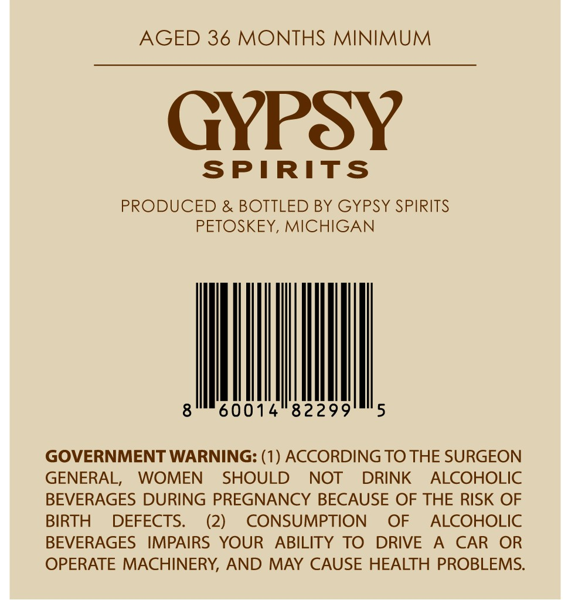
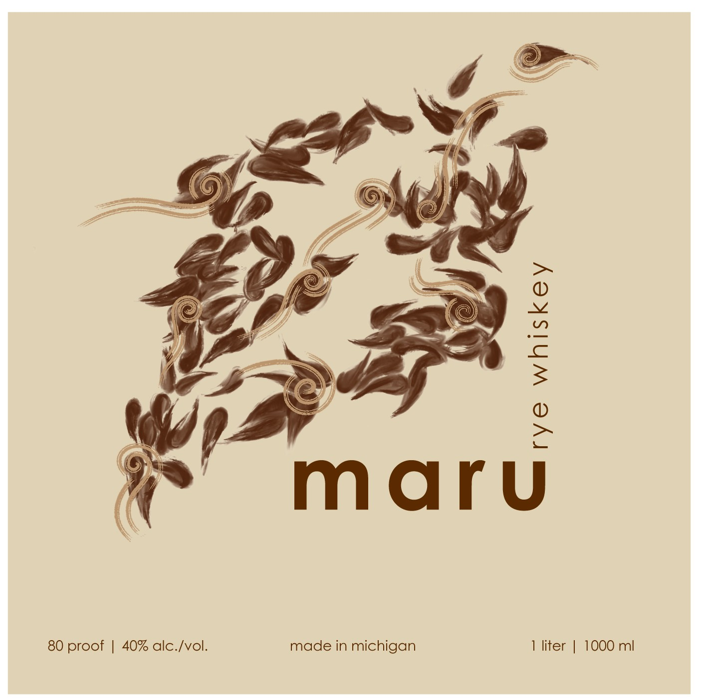

# TTB COLA Label Images - TTBID 26068001000747

**Brand Name:** MARU

**Issue Date:** 03/10/2026

**Origin Code:** 06

**Product Class/Type:** 142

**Source:** [TTB Public COLA Registry](https://ttbonline.gov/colasonline/viewColaDetails.do?action=publicFormDisplay&ttbid=26068001000747)

## Label Images

### Back Label

### Front Label

## Extracted Label Text

*Text extracted via OCR - may contain errors*

**Detected Proof:** 80

### Back Label

AGED 36 MONTHS MINIMUM

GYPSY

SPIRITS

PRODUCED & BOTTLED BY GYPSY SPIRITS

PETOSKEY, MICHIGAN

Mill

GOVERNMENT WARNING: (1) ACCORDING TO THE SURGEON

GENERAL, WOMEN SHOULD NOT DRINK ALCOHOLIC

BEVERAGES DURING PREGNANCY BECAUSE OF THE RISK OF

BIRTH DEFECTS.

(2)

CONSUMPTION OF ALCOHOLIC

BEVERAGES IMPAIRS YOUR ABILITY TO DRIVE A CAR OR

OPERATE MACHINERY, AND MAY CAUSE HEALTH PROBLEMS

### Front Label

1
maru
80 proof
40% alc-Ivol.
made in michigan
liter
1000 ml
