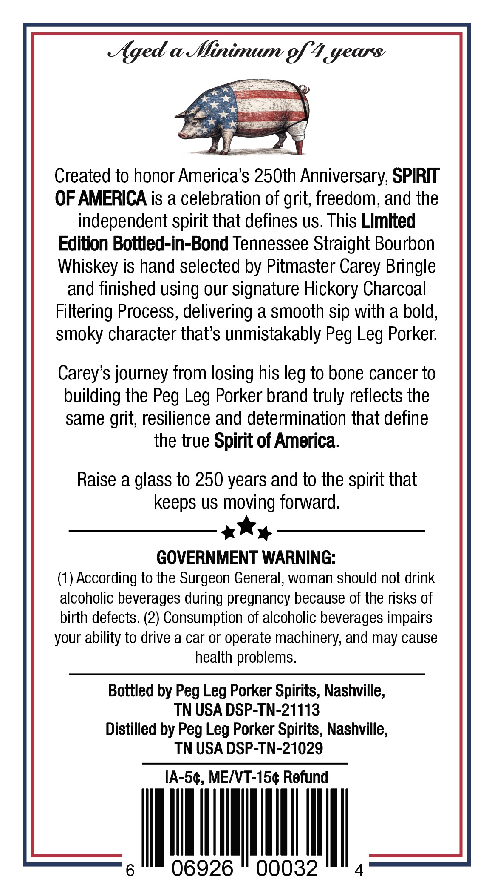
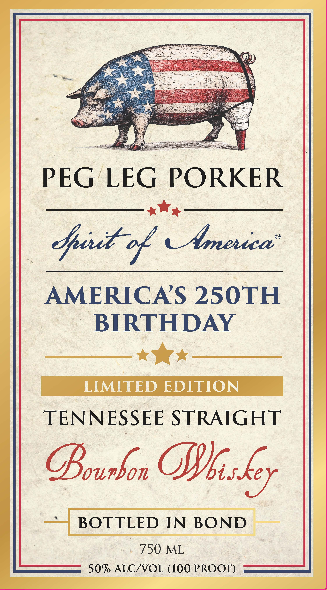

# TTB COLA Label Images - TTBID 26068001000904

**Brand Name:** PEG LEG PORKER

**Fanciful Name:** SPIRIT OF AMERICA

**Issue Date:** 03/10/2026

**Origin Code:** 43

**Product Class/Type:** 101

**Source:** [TTB Public COLA Registry](https://ttbonline.gov/colasonline/viewColaDetails.do?action=publicFormDisplay&ttbid=26068001000904)

## Label Images

### Back Label

### Front Label

## Extracted Label Text

*Text extracted via OCR - may contain errors*

*1 image(s) excluded: text did not meet readability threshold*

### Back Label

Aged & Nbinimum gf4yeas
Created to honor Americas 250th Anniversary; SPIRIT
OF AMERICA is a celebration of grit; freedom, and the
independent spirit that defines uS. This Limited
Edition Bottled-in-Bond Tennessee Straight Bourbon
Whiskey is hand selected by Pitmaster Carey Bringle
and finished using our signature Hickory Charcoal
Filtering Process, delivering a smooth sip with a bold,
smoky character that's unmistakably Peg Leg Porker:
Carey's journey from losing his leg to bone cancer to
building the Peg Leg Porker brand truly reflects the
same
resilience and determination that define
the true Spirit of America:
Raise a glass to 250 years and to the spirit that
keeps US moving forward:
GOVERNMENT WARNING:
(1) According to the Surgeon General, woman should not drink
alcoholic beverages during pregnancy because of the risks of
birth defects. (2) Consumption of alcoholic beverages impairs
your ability to drive a car or operate machinery, and
cause
health problems.
Bottled by Peg Leg Porker Spirits; Nashville,
TN USA DSP-TN-21113
Distilled by
Porker Spirits, Nashville;
TN USA DSP-TN-21029
IA-5c; MEIVT-154 Refund
06926
00032
4
grit;
may
Peg
Leg
