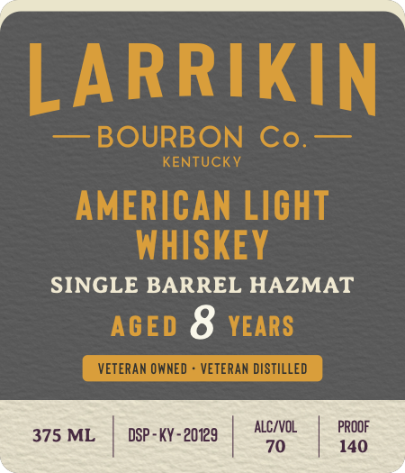
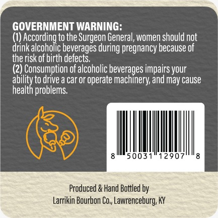

# TTB COLA Label Images - TTBID 26068001000947

**Brand Name:** LARRIKIN BOURBON CO.

**Fanciful Name:** AMERICAN LIGHT WHISKEY

**Issue Date:** 03/12/2026

**Origin Code:** 22

**Product Class/Type:** 144

**Source:** [TTB Public COLA Registry](https://ttbonline.gov/colasonline/viewColaDetails.do?action=publicFormDisplay&ttbid=26068001000947)

## Label Images

### Front Label

### Label 2

## Extracted Label Text

*Text extracted via OCR - may contain errors*

**Detected Age:** 8 Years

### Front Label

LARRIKIN
BOURBON
Co.
KENTUCKY
AMERICAN LIGHT
WHISKEY
SINGLE BARREL HAZMAT
AGED 8 YEARS
VETERAN OWNED
VETERAN DISTILLED
alC/VOL
PROOF
375 ML
DSP - KY - 20129
70
140

### Label 2

GOVERNMENT WARNING:
(I) eet tothe Surgeon General, women should not
drink alcoholic beverages during pregnancy because of
the risk of birth defects, 5
(2) Consumption of alcoholic beverages impairs your
aie drive a car or operate machinery, and may cause
health problems.
8 YIN | 8
Produced & Hand Bottled by
Larrikin Bourbon Co,, Lawrenceburg, KY
