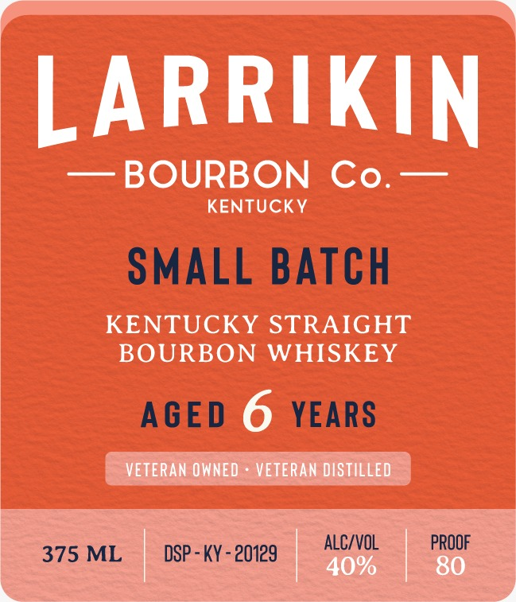
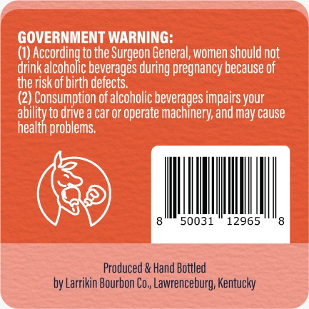

# TTB COLA Label Images - TTBID 26068001000948

**Brand Name:** LARRIKIN BOURBON CO.

**Fanciful Name:** SMALL BATCH

**Issue Date:** 03/10/2026

**Origin Code:** 22

**Product Class/Type:** 101

**Source:** [TTB Public COLA Registry](https://ttbonline.gov/colasonline/viewColaDetails.do?action=publicFormDisplay&ttbid=26068001000948)

## Label Images

### Label 1

### Label 2

## Extracted Label Text

*Text extracted via OCR - may contain errors*

**Detected Proof:** 80
**Detected Age:** 6 Years

### Label 1

LARRIKIN
BOURBON
Co.
KENTUCKY
SMALL BATCH
KENTUCKY STRAIGHT
BOURBON
WHISKEY
AGED 6
YEARS
VETERAN OWNED
VETERAN DISTILLED
375 ML
DSP - KY - 20129
ALC/VOL
PROOF
40%
80

### Label 2

GOVERNMENT WARNING:
(1)
to the
General, women should not
drink
ncacdhoxcdeesaggedufegeregnaneusbause oot
the risk of birth defects:
(2) Consumption of alcoholic beverages impairs your
ability to drive a car or operate machinery;and may cause
health problems:
50031
12965
Produced & Hand Bottled
by Larrikin Bourbon Co, Lawrenceburg; Kentucky
'Surgeon
