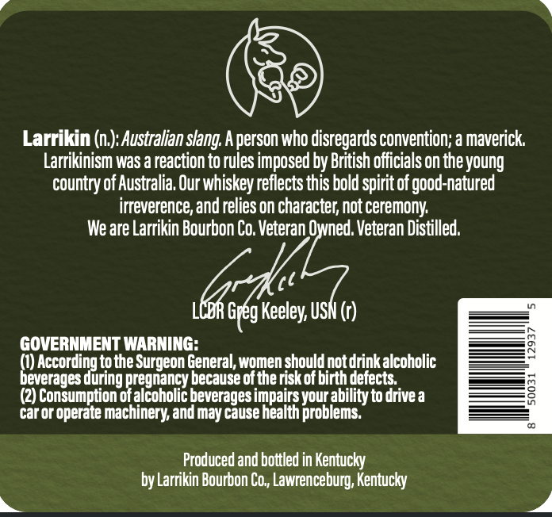
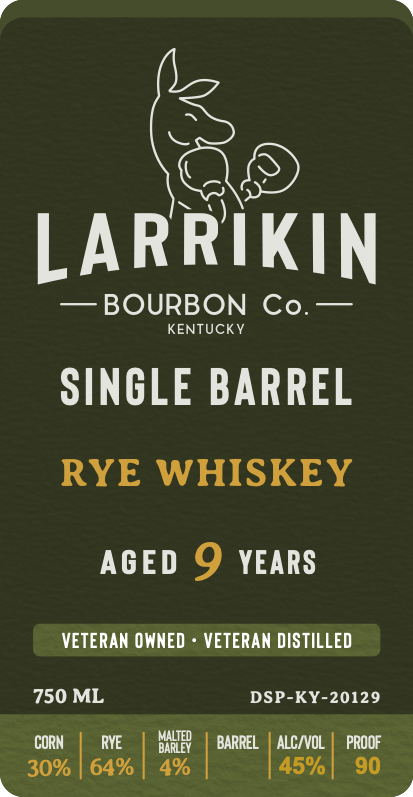

# TTB COLA Label Images - TTBID 26068001000950

**Brand Name:** LARRIKIN BOURBON CO.

**Fanciful Name:** AMERICAN RYE WHISKEY

**Issue Date:** 03/17/2026

**Origin Code:** 22

**Product Class/Type:** 142

**Source:** [TTB Public COLA Registry](https://ttbonline.gov/colasonline/viewColaDetails.do?action=publicFormDisplay&ttbid=26068001000950)

## Label Images

### Back Label

### Front Label

## Extracted Label Text

*Text extracted via OCR - may contain errors*

**Detected Proof:** 60
**Detected Age:** 9 Years

### Back Label

.

Larrikin (n.): Australian slang. A person who disregards convention; a maverick.
Larrikinism was a reaction to rules imposed by British officials on the young
country of Australia, Our whiskey reflects this bold spirit of good-natured
irreverence, and relies on character, not ceremony.

We are Larrikin Bourbon Co. Veteran Owned. Veteran Distilled.

bck
LCBR Greg Keeley, USN (r)

GOVERNMENT WARNING: ; :

i) According to the Surgeon General, women should not drink alcoholic
everages during pregnancy because of the risk of birth defects,

(2) Consumption of alcoholic beverages impairs your ability to drive a

Car or operate machinery, and may cause health problems.

Produced and bottled in Kentucky
by Larrikin Bourbon Co,, Lawrenceburg, Kentucky

### Front Label

LARRIKIN
BOURBON Co.
KENTUCKY
SINGLE BARREL
RYE WHISKEY
AGED 9
YEARS
VETERAN OWNED
VETERAN DISTILLED
750 ML
DSP-KY-20129
CORN
RYE
bariep
BARREL
ALCIVOL
PROOF
30%
64%
4%
45% [
90
