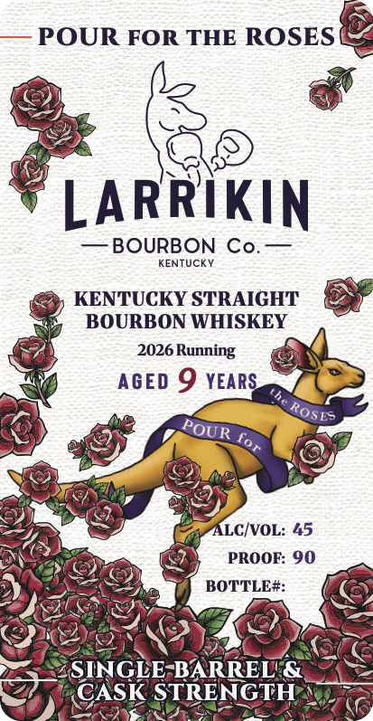
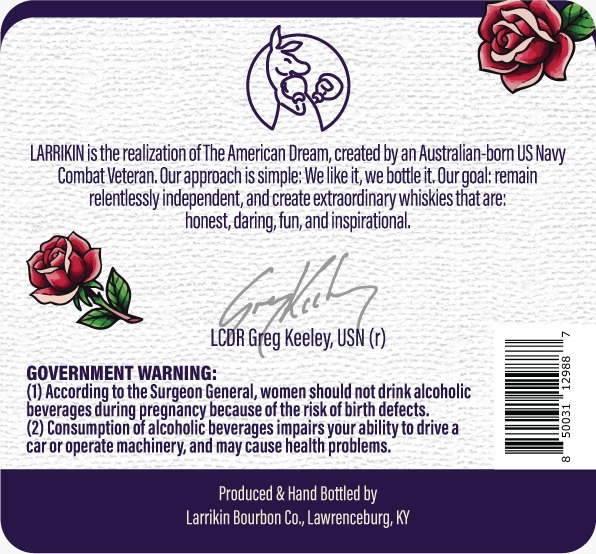

# TTB COLA Label Images - TTBID 26068001000952

**Brand Name:** LARRIKIN BOURBON CO.

**Fanciful Name:** POUR FOR THE ROSES

**Issue Date:** 03/12/2026

**Origin Code:** 22

**Product Class/Type:** 101

**Source:** [TTB Public COLA Registry](https://ttbonline.gov/colasonline/viewColaDetails.do?action=publicFormDisplay&ttbid=26068001000952)

## Label Images

### Front Label

### Label 2

## Extracted Label Text

*Text extracted via OCR - may contain errors*

**Detected Proof:** 90
**Detected Age:** 9 Years

### Front Label

POUR FOR THE ROSES
LARRIKIN
BOURBON Co.
KENTUCKY
KENTUCKY STRAIGHT
BOURBON WHISKEY
2026 Running
AGED 9 YEARS
ALCIVOL: 45
PROOF: 90
BOTTLE#:
SINGLE-BARREL &
CASK STRENGTH
ROSE?
POUR
for

### Label 2

S

LARRIKIN is the realization of The American Dream, created by an Australian-born US Navy

Combat Veteran, Our approach is simple: We like it, we bottle it. Our goal: remain

relentlessly independent, and create extraordinary whiskies that are:

honest, daring, fun, and inspirational.

LCDR Greg Keeley, USN (r)

GOVERNMENT WARNING:

(1) According to the Surgeon General, women should not drink alcoholic

beverages during

regnancy because of the risk of birth defects.

(2) Consumption

tt

alcoholic beverages impairs your ability to drive a

car or operate machinery, and may cause health problems,

Produced & Hand Bottled by

Larrikin Bourbon Co,, Lawrenceburg, KY
