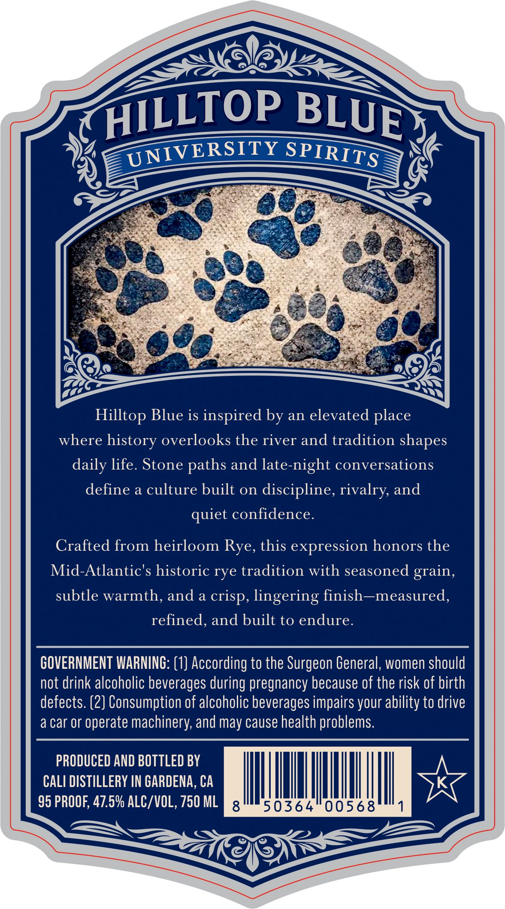
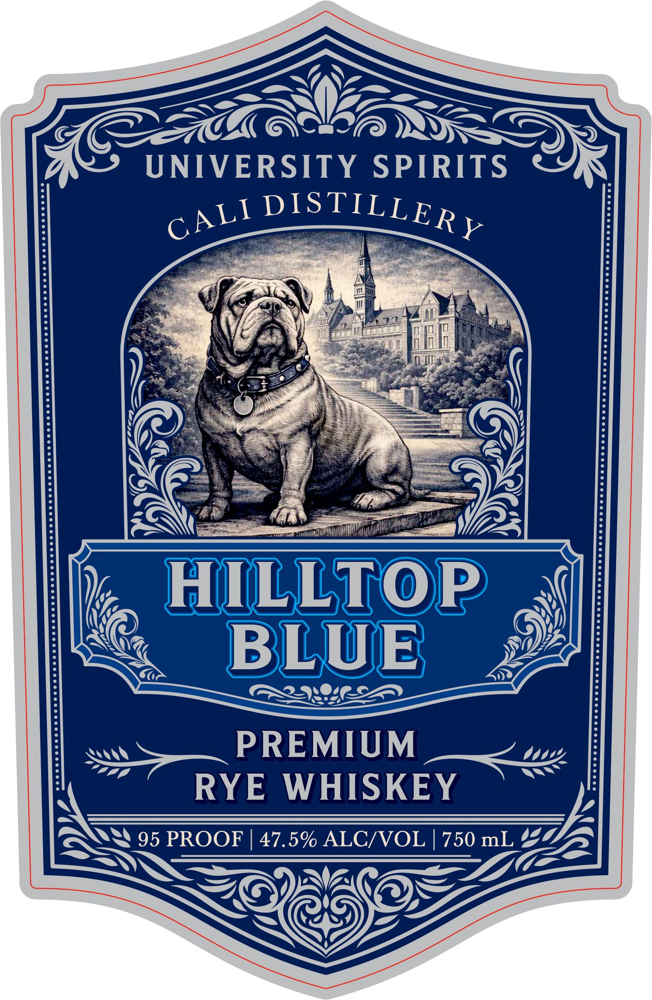

# TTB COLA Label Images - TTBID 26068001000964

**Brand Name:** HILLTOP BLUE

**Fanciful Name:** UNIVERSITY SPIRITS

**Issue Date:** 03/10/2026

**Origin Code:** 01

**Product Class/Type:** 142

**Source:** [TTB Public COLA Registry](https://ttbonline.gov/colasonline/viewColaDetails.do?action=publicFormDisplay&ttbid=26068001000964)

## Label Images

### Back Label

### Front Label

## Extracted Label Text

*Text extracted via OCR - may contain errors*

**Detected Proof:** 95

### Back Label

UNIVERSITY
Hilltop Blue is inspired by an elevated place
where history overlooks the river and tradition shapes
daily life. Stone
and late-night conversations
define a culture built on discipline, rivalry, and
confidence.
Crafted from heirloom
this expression honors the
Mid-Atlantic's historic rye tradition with seasoned grain,
subtle warmth, and a
lingering finish--measured,
refined, and built to endure.
GOVERNMENT WARNING: (1] According to the Surgeon General; women should
not drink alcoholic beverages during pregnancy because of the risk of birth
defects. (2] Consumption of alcoholic beverages impairs your ability to drive
a car Or
operate machinery; and
cause health problems.
PRODUCED AND BOTTLED BY
CALI DISTILLERY IN GARDENA, CA
95 PROOF; 47.5% ALC/VOL, 750 ML
8
50364
00568
HILLTOP
BLUE
SPIRITS
paths
quiet
Rye,
crisp,
may

### Front Label

—

—-

Qe

IVA

DHA

AILS

>————— >)

U

NIVERSITY SPIRITS

ard

SO

Au! DISTILLEp

\s

il

-

nyo

iF

ie W

4

}

W

A

eds

CL cid

Tin cam WEES

lhe

- ~HILLT LTOP

SN <a,

Sa

BLUE

FRA NOIR ED

PREMIUM

RY

E WHISKEY

\

lt>

he

SSS)

8 95 PROOF | 47.5% ALC/VOL | 750 mL ¥

Yea

y:

— NAS

———_ Sef

yp

AG

©

oS

WP
