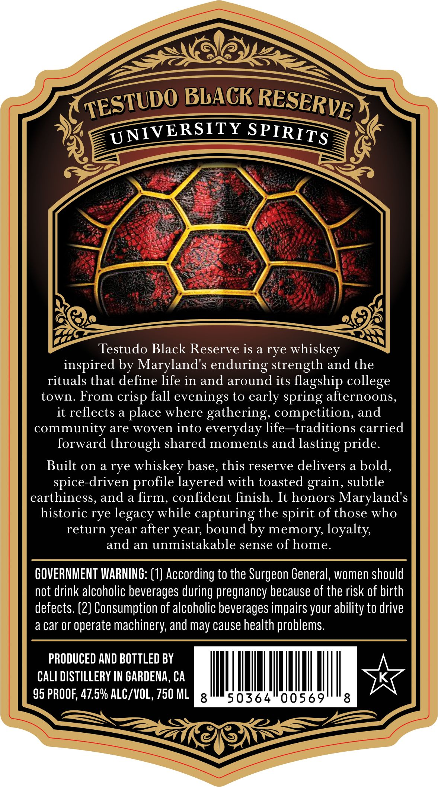
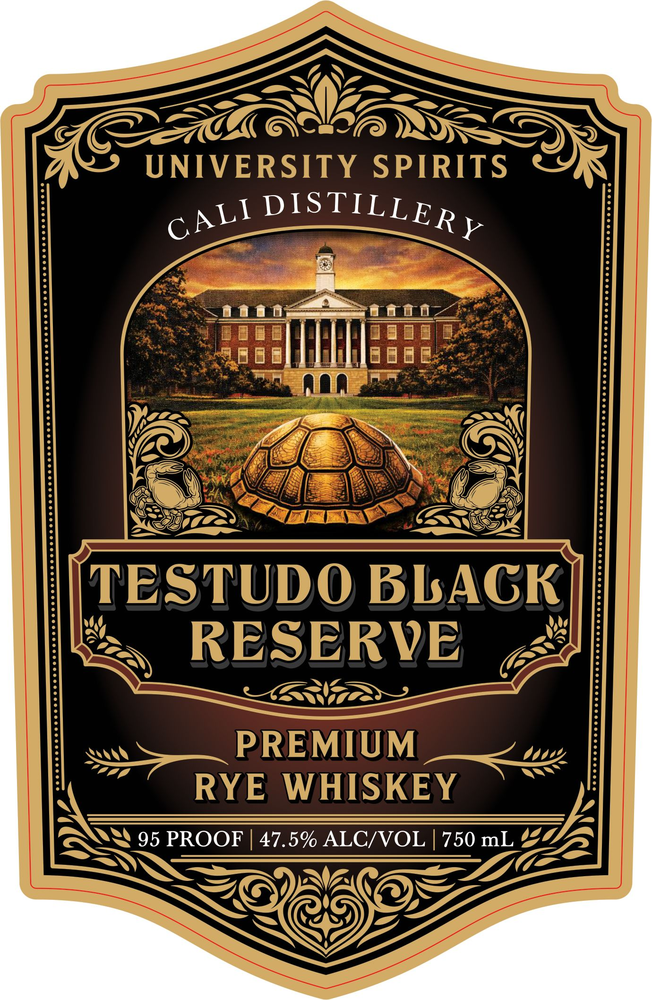

# TTB COLA Label Images - TTBID 26068001000966

**Brand Name:** TESTUDO BLACK RESERVE

**Fanciful Name:** UNIVERSITY SPIRITS

**Issue Date:** 03/10/2026

**Origin Code:** 01

**Product Class/Type:** 142

**Source:** [TTB Public COLA Registry](https://ttbonline.gov/colasonline/viewColaDetails.do?action=publicFormDisplay&ttbid=26068001000966)

## Label Images

### Back Label

### Front Label

## Extracted Label Text

*Text extracted via OCR - may contain errors*

**Detected Proof:** 95

### Back Label

BLAGK
UNIVERSITY
Testudo Black Reserve is a rye
whiskey
inspired by Maryland's enduring strength and the
rituals that define life in and around its flagship
town. From
fall
evenings to early spring afternoons,
it reflects a place where gathering, competition, and
community are woven into everyday life -traditions carried
forward through shared moments and
Built on a rye
whiskey base, this reserve delivers a bold,
spice-driven profile layered with toasted grain, subtle
earthiness, and a firm, confident finish. It honors Maryland's
historic rye legacy while capturing the
of those who
return year after year; bound by memory loyalty
and an unmistakable sense of home.
GOVERNMENT WARNING: (1] According to the Surgeon General, women should
not drink alcoholic beverages during pregnancy because of the risk of birth
defects. (2} Consumption of alcoholic beverages impairs your ability to drive
a car Or
operate machinery, and may cause health problems.
PRODUCED AND BOTTLED BY
CALI DISTILLERY IN GARDENA, CA
95 PROOF, 47.5% ALC/VOL, 750 ML
8
50364
0056
8
TESTUDO
RESERVE
SPIRITS
college
crisp
lasting
pride.
spirit

### Front Label

C7
UNIVERSITY
SPIRITS
TESTUDO BBAGK
RESERVE
PREMIUM
RYE WHISKEY
95 PROOF
47.5% ALC/VOL
750 mL
DISTILLERY
CALI
