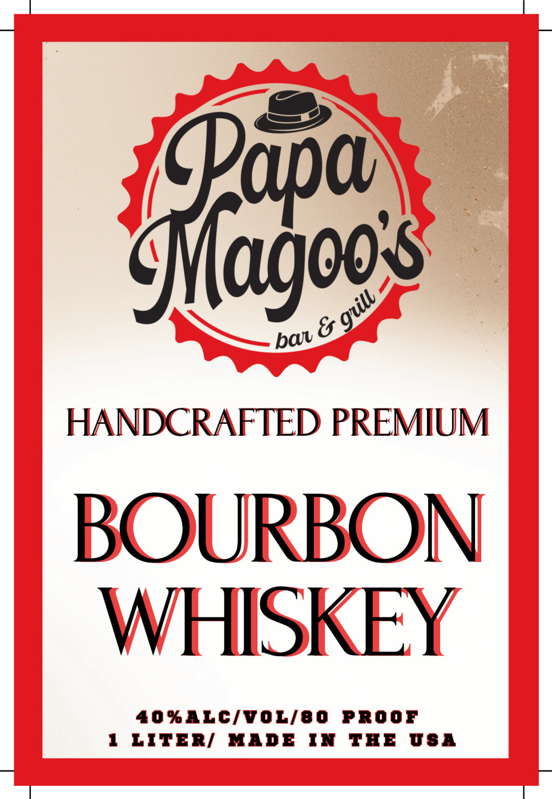
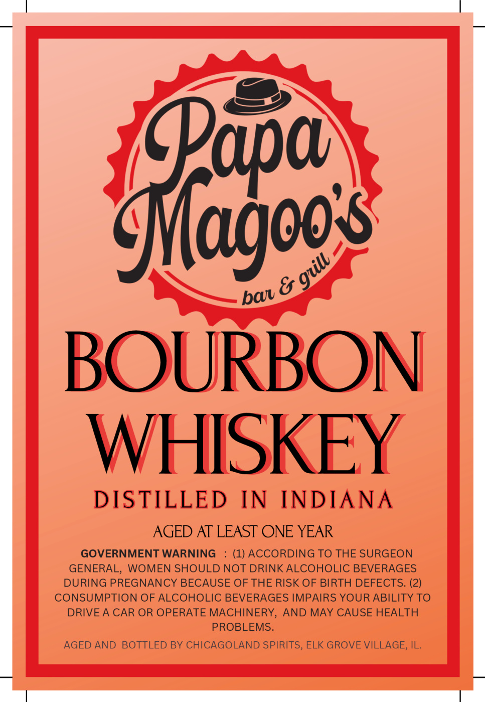

# TTB COLA Label Images - TTBID 26068001000980

**Brand Name:** PAPA MAGOO'S BAR & GRILL

**Issue Date:** 03/10/2026

**Origin Code:** 04

**Product Class/Type:** 141

**Source:** [TTB Public COLA Registry](https://ttbonline.gov/colasonline/viewColaDetails.do?action=publicFormDisplay&ttbid=26068001000980)

## Label Images

### Label 1

### Label 2

## Extracted Label Text

*Text extracted via OCR - may contain errors*

**Detected Proof:** 80

### Label 1

Sagooe
{
HANDCRAFTED PREMIUM
BOURBON
WHISKEY
40 %ALC/VOL/8O
PROOF
1
LITERI
MADB
IN
ThB
USA
8
bal

### Label 2

Srgos
{
BOURBON
WHISKEY
DISTILLED
IN
INDIANA
AGED AT LEAST ONE YEAR
GOVERNMENT WARNING
(1) ACCORDING TO THE SURGEON
GENERAL, WOMEN SHOULD NOT DRINK ALCOHOLIC BEVERAGES
DURING PREGNANCY BECAUSE OF THE RISK OF BIRTH DEFECTS. (2)
CONSUMPTION OF ALCOHOLIC BEVERAGES IMPAIRS YOUR ABILITY TO
DRIVEA CAR OR OPERATE MACHINERY,
AND MAY CAUSE HEALTH
PROBLEMS.
AGED AND
BOTTLED BY CHICAGOLAND SPIRITS, ELK GROVE VILLAGE, IL:
guill
baj
