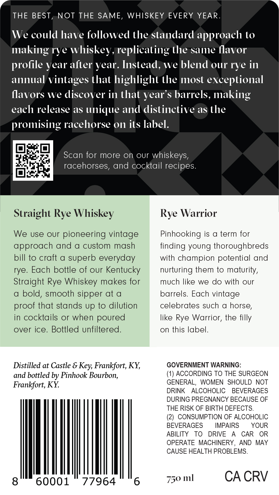

# TTB COLA Label Images - TTBID 26069001000143

**Brand Name:** PINHOOK

**Issue Date:** 03/10/2026

**Origin Code:** 22

**Product Class/Type:** 101

**Source:** [TTB Public COLA Registry](https://ttbonline.gov/colasonline/viewColaDetails.do?action=publicFormDisplay&ttbid=26069001000143)

## Label Images

### Front Label

## Extracted Label Text

*Text extracted via OCR - may contain errors*

### Front Label

THE BEST, NOT THE SAME, WHISKEY EVERY YEAR

We

could have followed the standard approach to

making rye

whiskey, replicating the same flavor

profile year after year. Instead, we blend our rye

in

annual vintages that highlight the most exceptional

flavors we

discover in that year’s

s barrels, making

each release as unique and distinctive as the

promising racehorse on its label

Scan for more on our whiskeys

26

racehorses, and cocktail recipes

inet

Straight Rye Whiskey

Rye Warrior

We use our pioneering vintage

Pinhooking is a term for

approach and a custom mash

finding young thoroughbreds

bill to craft a superb everyday

with champion potential and

rye. Each bottle of our Kentucky

nurturing them to maturity,

Straight Rye Whiskey makes for

much like we do with our

a bold, smooth sipper at a

barrels. Each vintage

celebrates such a horse

proof that stands up to dilution

in cocktails or when poured

like Rye Warrior, the filly

over ice. Bottled unfiltered

on this label

Distilled at Castle & Key, Frankfort, KY,

GOVERNMENT WARNING

and bottled by Pinhook Bourbon,

(1) ACCORDING TO THE SURGEON

GENERAL, WOMEN SHOULD NOT

Frankfort, KY.

DRINK ALCOHOLIC BEVERAGES

DURING PREGNANCY BECAUSE OF

THE RISK OF BIRTH DEFECTS

(2) CONSUMPTION OF ALCOHOLIC

BEVERAGES

IMPAIRS

YOUR

ABILITY TO DRIVE A CAR OR

OPERATE MACHINERY, AND MAY

CAUSE HEALTH PROBLEMS

0001 77964

750 ml

CA CRV
