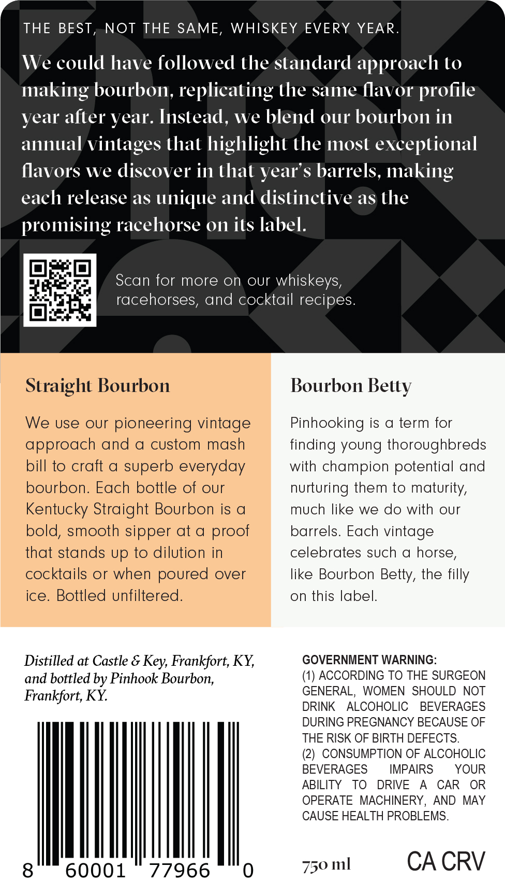

# TTB COLA Label Images - TTBID 26069001000161

**Brand Name:** PINHOOK

**Issue Date:** 03/17/2026

**Origin Code:** 22

**Product Class/Type:** 101

**Source:** [TTB Public COLA Registry](https://ttbonline.gov/colasonline/viewColaDetails.do?action=publicFormDisplay&ttbid=26069001000161)

## Label Images

### Front Label

## Extracted Label Text

*Text extracted via OCR - may contain errors*

### Front Label

THE BEST
NOT THE SAME,
WHISKEY EVERY
YEAR
We could have followed the standard approaeh to
making bourbon, replicating the same flavor profile
year alter year. Instead,
We blend our bourbon in
annual vintages that highlight the most exceptional
flavors We discover in that year s barrels,
making
each release as
unique and distinctive as the
promising racehorse 0n its label.
Scan for more on oUr
whiskeys,
racehorses, and cocktail recipes:
Straight Bourbon
Bourbon Belly
We use our pioneering vintage
Pinhooking is
a term for
approach and a custom mash
finding young thoroughbreds
bill to craft a superb everyday
with champion potential and
bourbon. Each bottle of our
nurturing them to maturity,
Kentucky Straight Bourbon is a
much like we do with our
bold, smooth sipper at a
barrels. Each vintage
that stands up to dilution in
celebrates such a horse,
cocktails or when poured over
like Bourbon Betty, the
ice.
Bottled unfiltered:
on
this label.
Distilled at Castle &
Frankfort; KY,
GOVERNMENT WARNING:
and bottled by Pinhook Bourbon;
(1) ACCORDING TO THE SURGEON
Frankfort; KY
GENERAL,
WOMEN  SHOULD
NOT
DRINK
ALCOHOLIC
BEVERAGES
DURING PREGNANCY BECAUSE OF
THE RISK OF BIRTH DEFECTS.
(2) CONSUMPTION OF ALCOHOLIC
BEVERAGES
IMPAIRS
YOUR
ABILITY
To
DRIVE
CAR
OR
OPERATE
MACHINERY,
AND MAY
CAUSE HEALTH PROBLEMS.
8
60001
77966
750 ml
CA CRV
proof
filly
Key;
