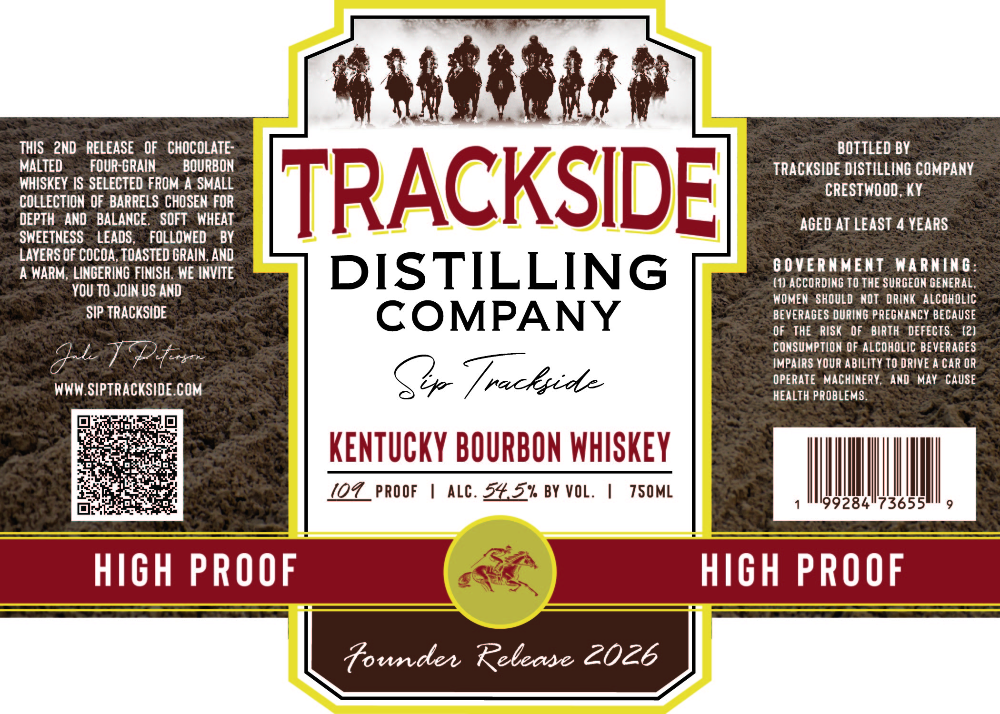
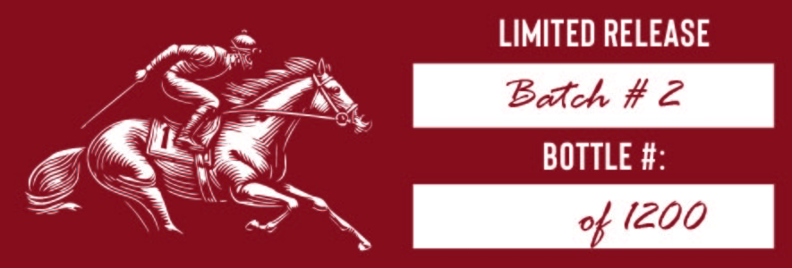

# TTB COLA Label Images - TTBID 26069001000256

**Brand Name:** TRACKSIDE

**Fanciful Name:** HIGH PROOF

**Issue Date:** 03/11/2026

**Origin Code:** 22

**Product Class/Type:** 141

**Source:** [TTB Public COLA Registry](https://ttbonline.gov/colasonline/viewColaDetails.do?action=publicFormDisplay&ttbid=26069001000256)

## Label Images

### Label 1

### Label 2

## Extracted Label Text

*Text extracted via OCR - may contain errors*

**Detected Age:** 4 Years

### Label 1

LL

THIS 2ND RELEASE OF CHOCOLATE

BOTTLED BY

MALTED

FOUR-GRAIN

BOURBON

TRACKSIDE DISTILLING COMPANY

WHISKEY IS SELECTED FROM-A SMALL

CRESTWOOD. KY

COLLECTION OF BARRELS CHOSEN FOR

DEPTH AND BALANCE. SOFT WHEAT

SWEETNESS

LEADS, FOLLOWED

BY

RACKSID

AGED AT LEAST 4 YEARS

LAYERS OF COCOA, TOASTED GRAIN, AND

GOVERNMENT WARNING

A WARM, LINGERING FINISH. WE INVITE

DISTILLING

(1) ACCORDING 10 THE SURGEON GENERAL

YOU T0 JOIN US AND

WOMEN SHOULD NOT DRINK ALCOHOLIC

SIP TRACKSIDE

BEVERAGES DURING PREGNANCY BECAUSE

COMPANY

OF THE RISK OF BIRTH DEFECTS. (2)

CONSUMPTION OF ALCOHOLIC BEVERAGES

DEAD Go

IMPAIRS YOUR ABILITY TO DRIVE A CAR OR

OPERATE MACHINERY, AND MAY CAUSE

WWW.SIPTRACKSIDE.COM

So /

HEALTH PROBLEMS

io

alg

bre et

cay ee

re

Lh

KENTUCKY BOURBON WHISKEY

pez

wy

(OV PROOF | ALC. 54.5% BY VOL

|

TSOML

RCL

ll) Il]

|

Founder Rebease 2OLE

### Label 2

LIMITED RELEASE

/ =A Butch #2
Miz yj
Z Qc BOTTLE #'

Sig nd
SA,
