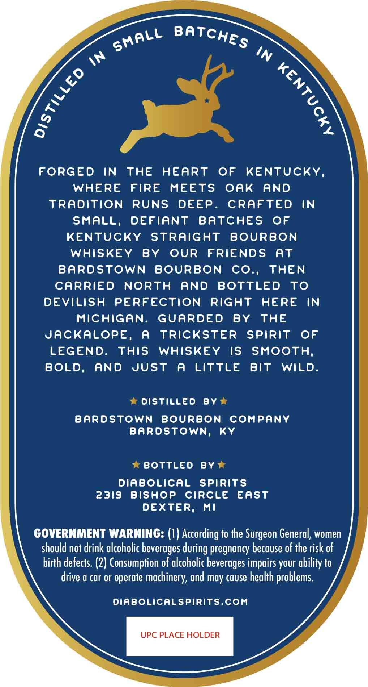
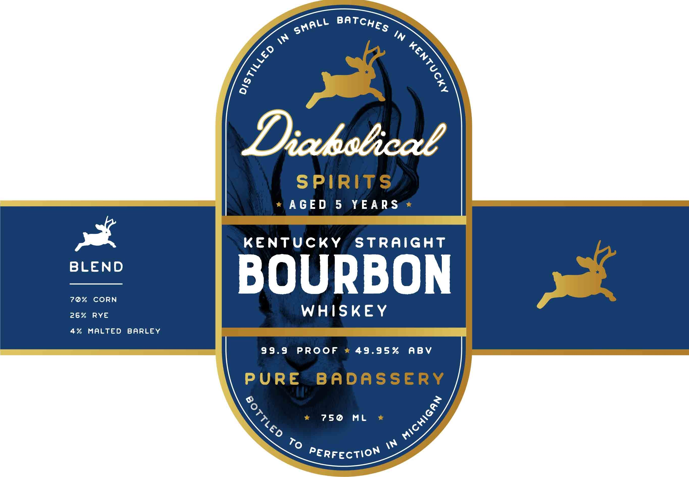

# TTB COLA Label Images - TTBID 26069001000338

**Brand Name:** DIABOLICAL SPIRITS

**Fanciful Name:** KENTUCKY STRAIGHT BOURBON WHISKEY

**Issue Date:** 03/11/2026

**Origin Code:** 06

**Product Class/Type:** 101

**Source:** [TTB Public COLA Registry](https://ttbonline.gov/colasonline/viewColaDetails.do?action=publicFormDisplay&ttbid=26069001000338)

## Label Images

### Back Label

### Front Label

## Extracted Label Text

*Text extracted via OCR - may contain errors*

**Detected Proof:** 99.9
**Detected Age:** 5 Years

### Back Label

In
FORGED
IN
THE
HEART
OF
KENTUCKY,
WHERE
FIRE
MEETS
oak
AND
TRaditioN
RUNS
DEEP
CRAFTED
IN
SMALL,
DEFIANT
BAtChES
OF
KENTUCky
straight
BOURBON
WhISkEY
BY
OUR
FRIENDS
at
BARDSTOWN
BOURBON
Co.,
THEN
CARRIED
NORTH
AND
BOTTLED
To
DEVILISH
PERFECTION
RIGht
HERE
IN
MichigaN:
GUARDED
BY
THE
JACKALoPE,
A
TRICKSTER
SPIRIT
OF
LEGEND.
this
WHISKEY
IS
SMoOTH;
BOLD,
AND
Just
A
LITtLE
BiT
WILD.
DIStiLLEd
By
Bardstown
BOURBON
comPany
BaRdStoWn;
Ky
BOTTLED
BY
Diabolical
Spirits
2319
BishoP
CiRcle
East
DEXTER,
Mi
GOVERNMENT WARNING: (I) According to the Surgeon General, women
should not drink alcoholic beverages
pregnancy because of the risk of
birth defects: (2) Consumption of alcoholic beverages impairs your ability to
drive a car or operate
mochinery, and may cause health problems.
diabolicalspirits.Com
UPC PLACE HOLDER
BatchES
SMALL
in
1
1
during

### Front Label

pal

BLEND

70% CORN
26% RYE

4% MALTED BARLEY

SPIRITS

* AGED 5 YEARS *

KENTUCKY STRAIGHT

BOURBON

WHISKEY

99.9 PROOF * 49.95% ABV

PURE BADASSERY

\w
PERFecTION
