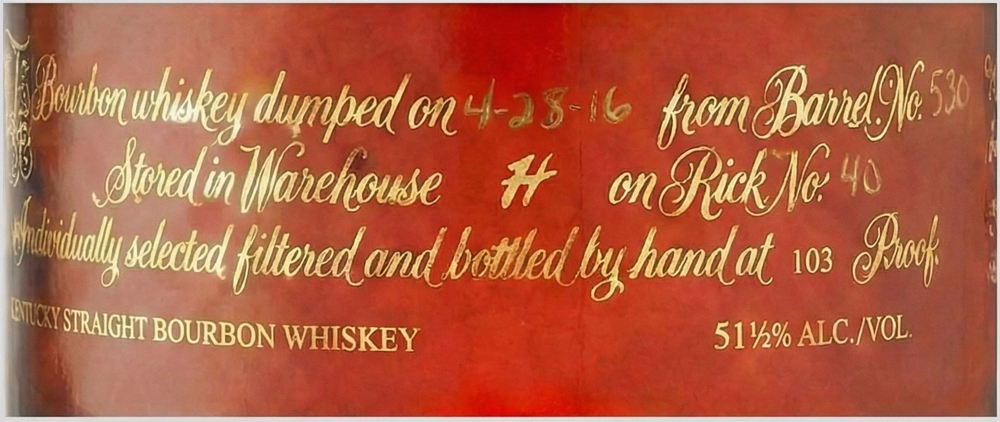
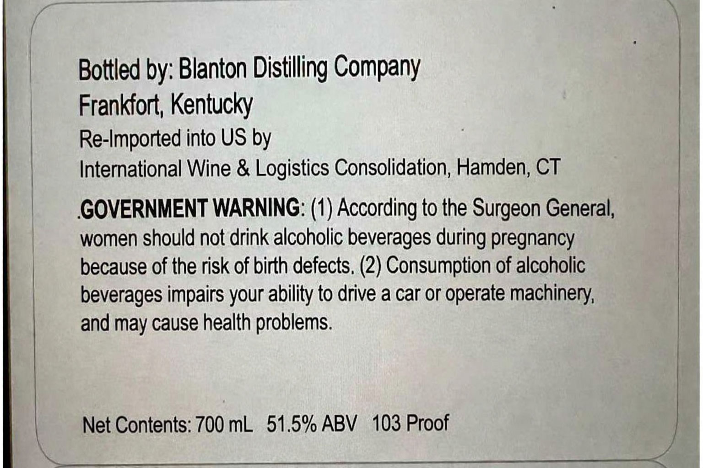

# TTB COLA Label Images - TTBID 26069001000372

**Brand Name:** BLANTON'S

**Fanciful Name:** GOLD EDITION

**Issue Date:** 03/11/2026

**Origin Code:** 00

**Product Class/Type:** 101

**Source:** [TTB Public COLA Registry](https://ttbonline.gov/colasonline/viewColaDetails.do?action=publicFormDisplay&ttbid=26069001000372)

## Label Images

### Front Label

### Label 2

### Label 3

## Extracted Label Text

*Text extracted via OCR - may contain errors*

*1 image(s) excluded: text did not meet readability threshold*

**Detected Proof:** 103

### Front Label

Doubon c
dumbed on4-25-1k  Rxom 8sdnnel965%
dtonedin Iflanehouse
#
On &Rick Nc 4
vbutyseected fttened and
handat 103
Qook
YSIraIGHT BOURBON WHISKEY
514% ALC /NOL;
uhiskey_
Ibottledby
ILXY F

### Label 2

Bottled by: Blanton Distilling Company
Frankfort; Kentucky
Re-Imported into US by
International Wine & Logistics Consolidation; Hamden; CT
GOVERNMENT WARNING: (1) According to the Surgeon General;
women should not drink alcoholic beverages during pregnancy
because of the risk of birth defects. (2) Consumption of alcoholic
beverages impairs your ability to drive a car or operate machinery;
and may cause health problems
Net Contents: 700 mL
51.5% ABV
103 Proof
