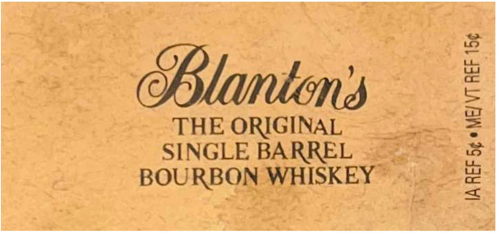
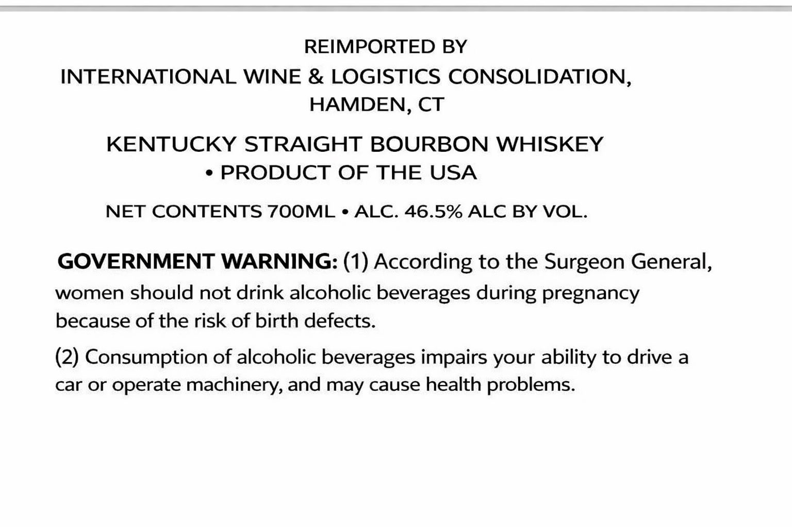

# TTB COLA Label Images - TTBID 26069001000377

**Brand Name:** INTERNATIONAL WINE & LOGISTICS CONSOLIDATION

**Fanciful Name:** SINGLE BARREL

**Issue Date:** 03/13/2026

**Origin Code:** 00

**Product Class/Type:** 101

**Source:** [TTB Public COLA Registry](https://ttbonline.gov/colasonline/viewColaDetails.do?action=publicFormDisplay&ttbid=26069001000377)

## Label Images

### Front Label

### Label 1

### Label 2

## Extracted Label Text

*Text extracted via OCR - may contain errors*

**Detected Proof:** 93

### Front Label

Slanten

THE ORIGINAL

SINGLE BARREL

BOURBON WHISKEY

### Label 1

“Each bottle is wcouted with he Wala Regist nan

We believe this is the finest

Blanton:

al Blanton Distilling Company,

Bourbon whiskey dumpedon s- 2-23 fon Banel Ve Ine

Distilling,

ES,

Stored in ffarehowse

on Sik No >

ote of wpishey ewer produced.“

Sia Registered, “pottle Noi 85

affording you extra flavor.

KENTUCKY STRAIGHT

Company”

tled by Blanton Distilling Company

Sndiiidually selected filtered and botled by handat 3 Proof:

BOURBON WHISKEY

es & Bot

‘rankfort, Kentucky

KENTUCKY STRAIGHT BOURBON WHISKEY

462% ALC./VOL., (93 PROOF)

750 ml

&

### Label 2

REIMPORTED BY
INTERNATIONAL WINE & LOGISTICS CONSOLIDATION,
HAMDEN, CT
KENTUCKY STRAIGHT BOURBON WHISKEY
PRODUCT OF THE USA
NET CONTENTS 7OOML ' ALC. 46.5% ALC BY VOL.
GOVERNMENT WARNING: (1) According to the Surgeon General,
women should not drink alcoholic beverages during pregnancy
because of the risk of birth defects.
(2) Consumption of alcoholic beverages impairs your ability to drive a
car Or
operate machinery, and may cause health problems:
