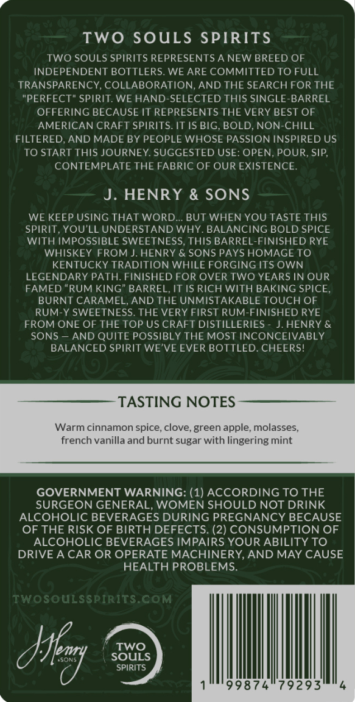
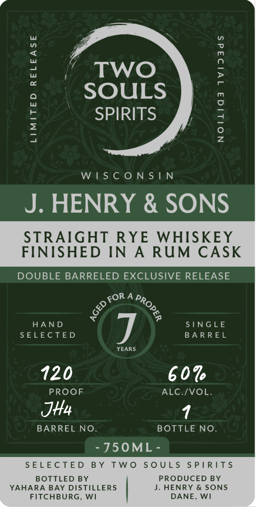

# TTB COLA Label Images - TTBID 26069001000447

**Brand Name:** TWO SOULS

**Issue Date:** 03/12/2026

**Origin Code:** 48

**Product Class/Type:** 102

**Source:** [TTB Public COLA Registry](https://ttbonline.gov/colasonline/viewColaDetails.do?action=publicFormDisplay&ttbid=26069001000447)

## Label Images

### Back Label

### Front Label

## Extracted Label Text

*Text extracted via OCR - may contain errors*

### Back Label

TWo SouLS SPIRITS
TWO SOULS SPIRITS REPRESENTS A NEW BREED OF
INDEPENDENT BOTTLERS. WE ARE COMMITTED TO FULL
TRANSPARENCY, COLLABORATION, AND THE SEARCH FOR THE
PERFECT" SPIRIT WE HAND-SELECTED THIS SINGLE-BARREL
OFFERING BECAUSE IT REPRESENTS THE VERY BEST OF
AMERICAN CRAFT SPIRITS. IT IS BIG, BOLD, NON-CHILL
FILTERED;AND MADE BY PEOPLE WHOSE PASSION INSPIRED US
TO START THIS JOURNEY. SUGGESTED USE: OPEN, POUR, SIP;
CONTEMPLATE THE FABRIC OF OUR EXISTENCE.
J
HENRY & SONS
WE KEEP USING THAT WORD.
BUT WHEN YOU TASTE THIS
SPIRIT YOU'LL UNDERSTAND WHY. BALANCING BOLD SPICE
WITH IMPOSSIBLE SWEETNESS, THIS BARREL-FINISHED RYE
WHISKEY FROM J. HENRY & SONS PAYS HOMAGE TO
KENTUCKY TRADITION WHILE FORGING ITS OWN
LEGENDARY PATH. FINISHED FOR OVER TWO YEARS IN OUR
FAMED "RUM KING" BARREL; IT IS RICH WITH BAKING SPICE
BURNT CARAMEL, AND THE UNMISTAKABLE TOUCH OF
RUM-Y SWEETNESS. THE VERY FIRST RUM-FINISHED RYE
FROM ONE OF THE TOP US CRAFT DISTILLERIES
HENRY &
SONS
AND QUITE POSSIBLY THE MOST INCONCEIVABLY
BALANCED SPIRIT WE'VE EVER BOTTLED. CHEERSI
TASTING NOTES
Warm cinnamon spice; clove, green apple; molasses_
french vanilla and burnt sugar with lingering mint
GOVERNMENT WARNING: (1) ACCORDING TO THE
SURGEON GENERAL, WOMEN SHOULD NOT DRINK
ALCOHOLIC BEVERAGES DURING PREGNANCY BECAUSE
OF THE RISK OF BIRTH DEFECTS: (2) CONSUMPTION OF
ALCOHOLIC BEVERAGES IMPAIRS YOUR ABILITY TO
DRIVE A CAR OR OPERATE MACHINERY, AND MAY CAUSE
HEALTH PROBLEMS.
TWosouLSSPIRITS CoM
Ayery
Two
LSONS
SOULS
SPIRITS
99874
79293

### Front Label

’ Two
SOULS
SPIRITS

LIMITED RELEASE
NOILIG3 1VI949dS

WISCONSIN

J. HENRY & SONS

STRAIGHT RYE WHISKEY
FINISHED IN A RUM CASK

DOUBLE BARRELED EXCLUSIVE RELEASE

ORA p,
S fo,
$ %
HAND SINGLE
SELECTED BARREL

YEARS

120 60%

PROOF ALC./VOL.
JH4 1
BARREL NO. BOTTLE NO.

-J5OML-
SELECTED BY TWO SOULS SPIRITS

BOTTLED BY PRODUCED BY
YAHARA BAY DISTILLERS J. HENRY & SONS
FITCHBURG, WI DANE, WI
