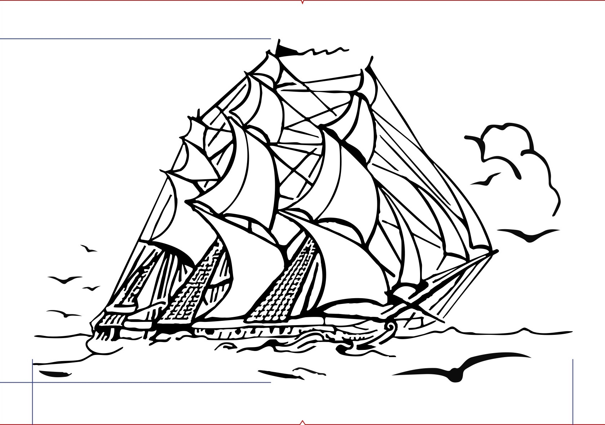
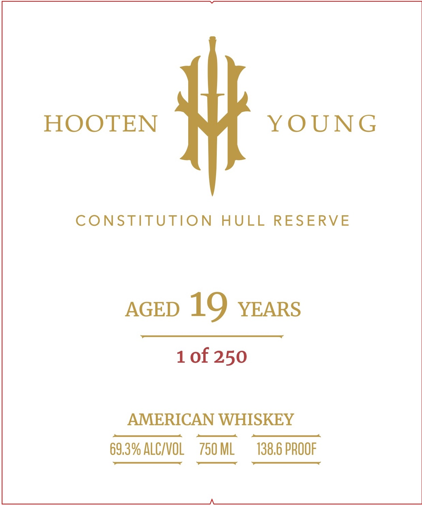
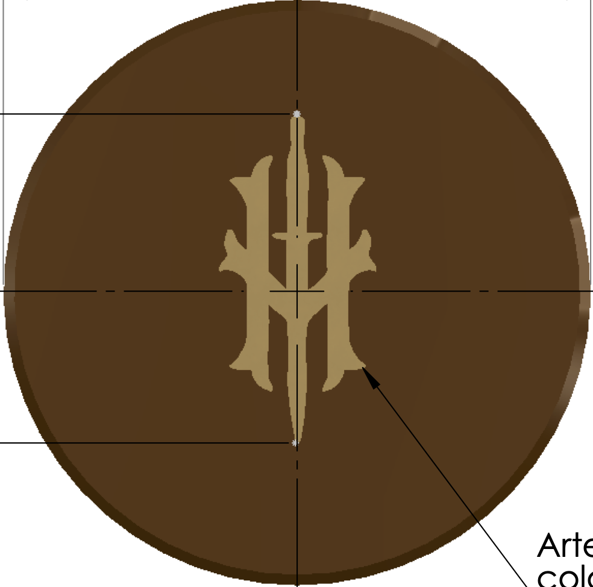
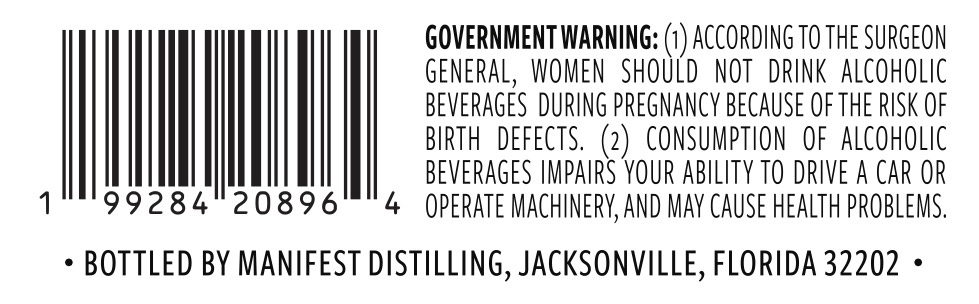

# TTB COLA Label Images - TTBID 26069001000801

**Brand Name:** HOOTEN YOUNG

**Fanciful Name:** CONSTITUTION HULL RESERVE

**Issue Date:** 03/11/2026

**Origin Code:** 16

**Product Class/Type:** 140

**Source:** [TTB Public COLA Registry](https://ttbonline.gov/colasonline/viewColaDetails.do?action=publicFormDisplay&ttbid=26069001000801)

## Label Images

### Back Label

### Front Label

### Label 3

### Label 4

## Extracted Label Text

*Text extracted via OCR - may contain errors*

*2 image(s) excluded: text did not meet readability threshold*

**Detected Age:** 19 Years

### Front Label

HOOTEN
#
Y OUNG
CONSTITUTION
HULL
RESERVE
AGED
19
YEARS
1 of 250
AMERICAN WHISKEY
69,3% ALCIVOL
750 ML
138,6 PROOF

### Label 4

GOVERNMENT WARNING:
ACCORdING TO ThE SURGEON
GENERAL,  WOMEN  SHOULD  NOT   DRINK  AlcohOLIc
BEVERAGES DURING PREgNancy BECAUSE OFTHE RUSK OF
BIRTH  dEFECTS,
2
CONSUMPTION   OF  AlCohOLIc
BEVERAGES IMPAIRS YOUR abilITy TO DRIVE A CAR OR
99284
20896
operate MAChiNERY,ANd MAy CauSe heAlTh PROBLEMS:
BOTTLED BY MANIFEST DISTILLING, JACKSONVILLE, FLORIDA 32202
