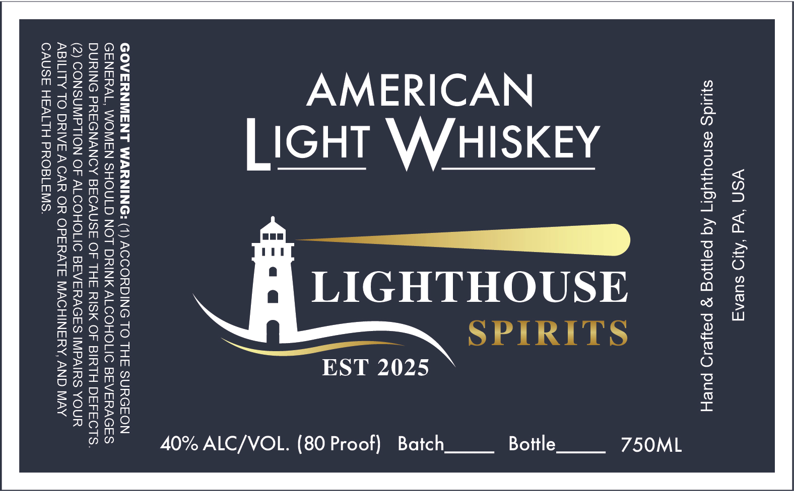

# TTB COLA Label Images - TTBID 26069001000822

**Brand Name:** LIGHTHOUSE SPIRITS

**Issue Date:** 03/26/2026

**Origin Code:** 39

**Product Class/Type:** 144

**Source:** [TTB Public COLA Registry](https://ttbonline.gov/colasonline/viewColaDetails.do?action=publicFormDisplay&ttbid=26069001000822)

## Label Images

### Label 1

## Extracted Label Text

*Text extracted via OCR - may contain errors*

**Detected Proof:** 80

### Label 1

YSN ‘Wd ‘AUD sueng
S}IdS asnoujybr] Aq paljog 9g payed puey

SPIRITS

EST 2025

LIGHTHOUSE

TL,
<
U
oO
Lu
=
<

LIGHT (WHISKEY

40% ALC/VOL. (80 Proof) Batch

GOVERNMENT WARNING: (1) ACCORDING TO THE SURGEON
GENERAL, WOMEN SHOULD NOT DRINK ALCOHOLIC BEVERAGES
DURING PREGNANCY BECAUSE OF THE RISK OF BIRTH DEFECTS.
(2) CONSUMPTION OF ALCOHOLIC BEVERAGES IMPAIRS YOUR
ABILITY TO DRIVE A CAR OR OPERATE MACHINERY, AND MAY
CAUSE HEALTH PROBLEMS.
