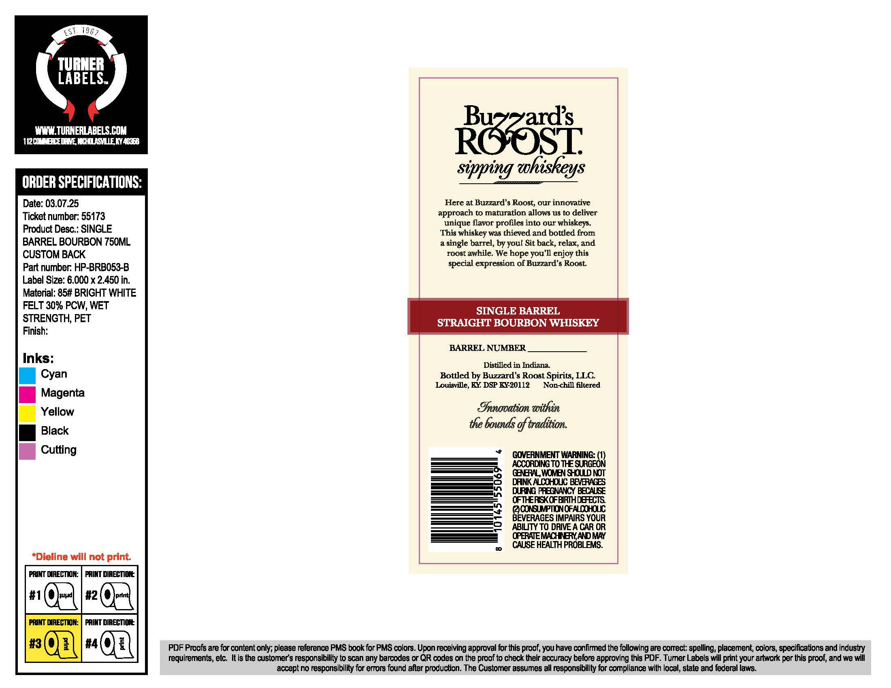
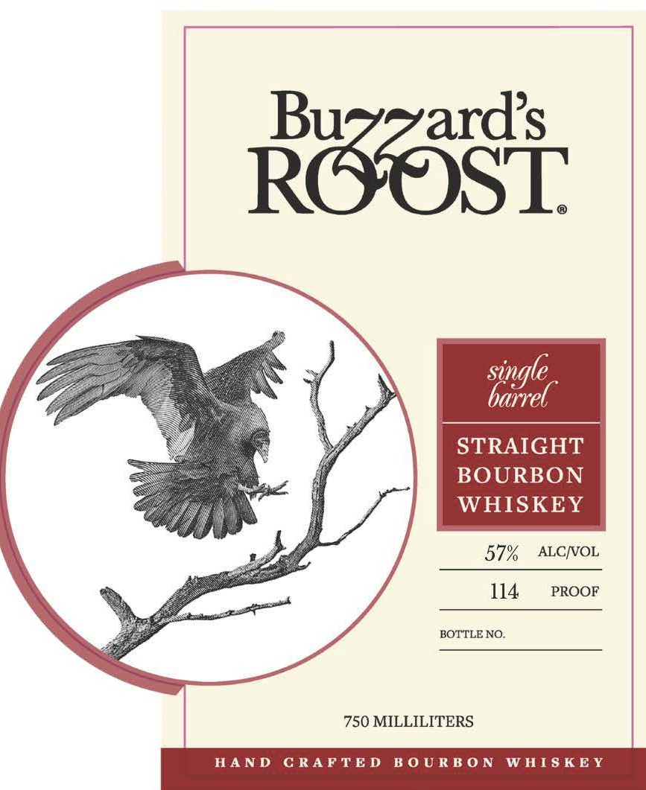

# TTB COLA Label Images - TTBID 26069001000853

**Brand Name:** BUZZARD'S ROOST

**Fanciful Name:** SINGLE BARREL STRAIGHT FROM THE BARREL BOURBON

**Issue Date:** 03/19/2026

**Origin Code:** 22

**Product Class/Type:** 101

**Source:** [TTB Public COLA Registry](https://ttbonline.gov/colasonline/viewColaDetails.do?action=publicFormDisplay&ttbid=26069001000853)

## Label Images

### Back Label

### Front Label

## Extracted Label Text

*Text extracted via OCR - may contain errors*

**Detected Proof:** 114

### Back Label

EsT,
TURNER
LABELS
I6YMLTURNERLABELSEO5
Raast
sipping whiskeys
ORDER SPECIFICATIONS:
Date: 03.07.25
Here at Buzzard : Roost; our innovative
Ticket number: 55173
approach to maturation allows us to deliver
unique flavor profiles into our whiskeys.
Product
SINGLE
This whiskey was thieved
bottled from
BARREL BOURBON 750ML
single barrel, by youl Sit back, relax, and
CUSTOM BACK
roost awhile: We
enjoy this
Part number: HP-BRBO53-B
special expression ofBuzzard' $ Roost
Label Size: 6.000 x 2.450 in:
Material: 85# BRIGHT WHITE
FELT 30% PCW;, WET
SINGLE BARREL
STRENGTH; PET
STRAIGHT BOURBON WHISKEY
Finish:
BARREL NUMBER
Inks:
Distilled in Indiana
Cyan
Bottled by Buzzard s Roost Spirits, LLC
Louisville, KY DSP KY20112
Non chill filtered
Magenta
Yellow
Enooation %ithen
the bounds gf traditiona
Black
Cutting
COVERNMENT WARNING:
ACCORDING TO TE
OuNGES
(BBAWOIBSOULDNOT
DRINK ACOHOUC BEWRNGES
DRNG FREGNANCY EECAKEE
OFTERKXOFBRIHDEECE
@COVEUMPIONOFNDOHICC
BEVERAGES IMPAIRS YOUR
ABIVTY TO DRIVE A CAR OR
OFERAEMNCHBYANDMAY
CAUSE HEALTH PROBLEMS
#Dieline will not print:
PNT WAECTTON:
RINT DIrEcCt
#1
wupd
#2
printi
F@NT CAECTION:
PAINT DIREcnO#
#3
[
#4
1
PDF Proois are for content only; please reference PMS book for PMS colors. Upon receiving approval for this proof, you have confimed the following are conect: spelling; placement; colors, specifications and industry
requirements, etc  It is the customers responsibility to scan any barcodes cr QR codes cn the proof to check their accuracy before approving this PDF. Tumer Labels will print your artwork per this prool, and we will
accept no responsibility for errors found after production: The Customer assumes all responsibility for compliance with local, state and federal iaws:
1967
Desc::
and
hope
you 1

### Front Label

STRAIGHT
BOURBON
WHISKEY

57%  ALC/VOL
114. prRoor

BOTTLE NO.

750 MILLILITERS

HAND CRAFTED BOURBON WHISKEY
