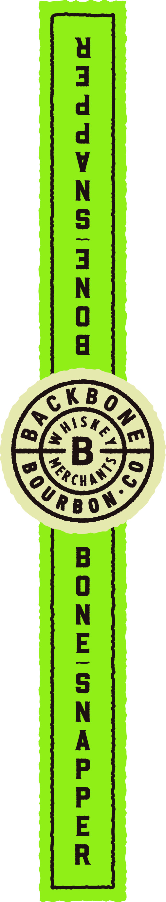
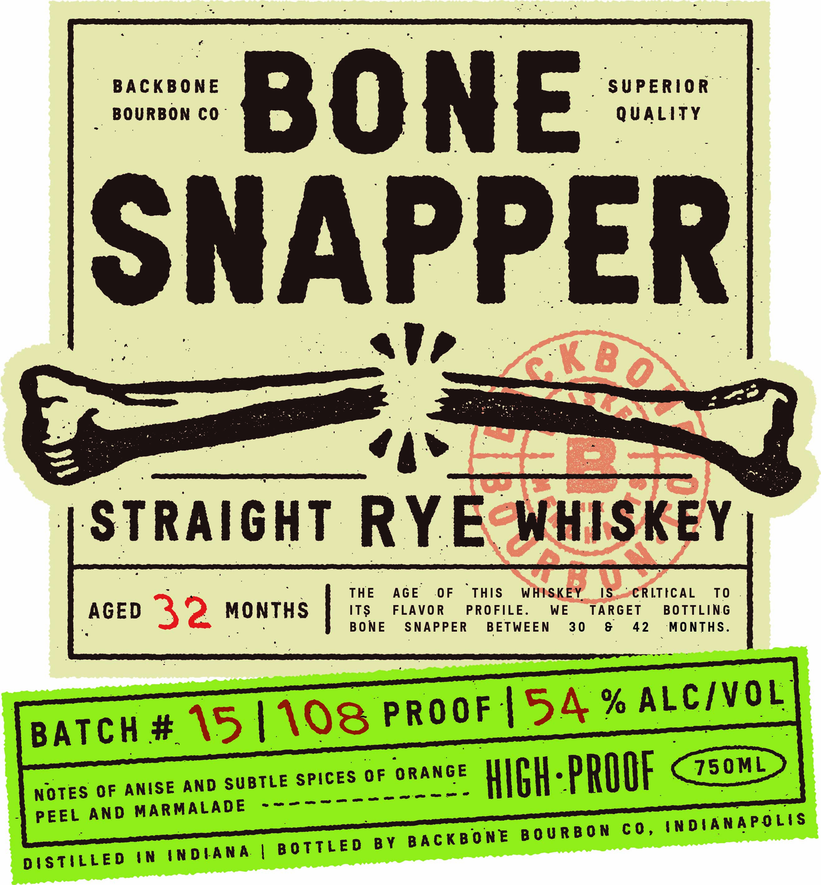

# TTB COLA Label Images - TTBID 26070001000054

**Brand Name:** BONE SNAPPER RYE WHISKEY

**Issue Date:** 03/11/2026

**Origin Code:** 19

**Product Class/Type:** 102

**Source:** [TTB Public COLA Registry](https://ttbonline.gov/colasonline/viewColaDetails.do?action=publicFormDisplay&ttbid=26070001000054)

## Label Images

### Back Label

### Front Label

## Extracted Label Text

*Text extracted via OCR - may contain errors*

*1 image(s) excluded: text did not meet readability threshold*

### Front Label

BACKBONE

SUPERIOR

BOURBON CO

QUALITY

BONE

ONAPPE

ale

PF Eo

ay

STRAIGHT RYE: WHISKEY

AGE

OF

“THIS

WHISKEY

IS.

eCRLTECAL

TO

AGED

ITS

FLAVOR

PROFILE

WE

TARGET

BOTTLING

MONTHS |

NE

SNAPPER

BETWEEN

30

&

42

MONTHS

+>

i wa

Ra

| \S

a © «

A. % A

ALC/VOL

Lv

> prOOF |S

BATCH F

S @

| \'

NOTES OF ANISE AND

= SPICES OF ORANGE WICH parr C7s0ML>

PEEL AND MARMALADE

INDIANAPOLIS

BON CO

TTLED BY BACKBONE BOUR

DISTILLED IN INDIANA | BO
