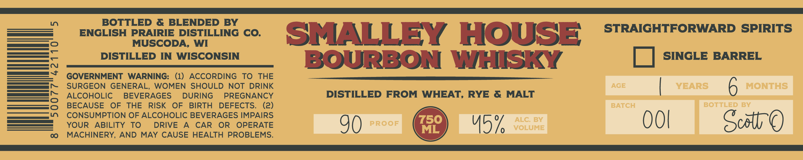
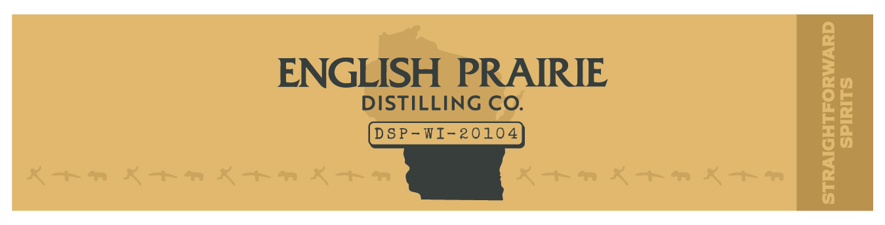

# TTB COLA Label Images - TTBID 26070001000265

**Brand Name:** SMALLEY HOUSE BOURBON WHISKY

**Issue Date:** 03/17/2026

**Origin Code:** 48

**Product Class/Type:** 141

**Source:** [TTB Public COLA Registry](https://ttbonline.gov/colasonline/viewColaDetails.do?action=publicFormDisplay&ttbid=26070001000265)

## Label Images

### Label 1

### Label 2

## Extracted Label Text

*Text extracted via OCR - may contain errors*

*1 image(s) excluded: text did not meet readability threshold*

**Detected Proof:** 90

### Label 1

1
BOTTLED & BLENDED BY
ENGLISH PRAIRIE DISTILLING CO.
SMALLEY
HOUSE
STRAIGHTFORWARD SPIRITS
MUSCODA, WI
:
DISTILLED IN
WISCONSIN
BOURBON
WHISKY
SINGLE BARREL
GOVERNMENT
WARNING:
(1)
ACCORDING
To
THE
N
SURGEON GENERAL,
WOMEN
SHOULD NOT DRINK
AGE
YEARS
6
MONTHS
ALCOHOLIC
BEVERAGES
DURING
PREGNANCY
DISTILLED FROM WHEAT, RYE &
MALT
BECAUSE
OF
THE
RISK
OF
BIRTH
DEFECTS.
(2)
BATCH
BOTTLED BY
CONSUMPTION OF ALCOHOLIC BEVERAGES IMPAIRS
750
ALC:
BV
00
Scottc
YOUR
ABILITY
To
DRIVE
A
CAR
OR
OPERATE
90
PROOF
ML
15%
VOLUME
0
MACHINERY, AND
MAY CAUSE HEALTH PROBLEMS.
