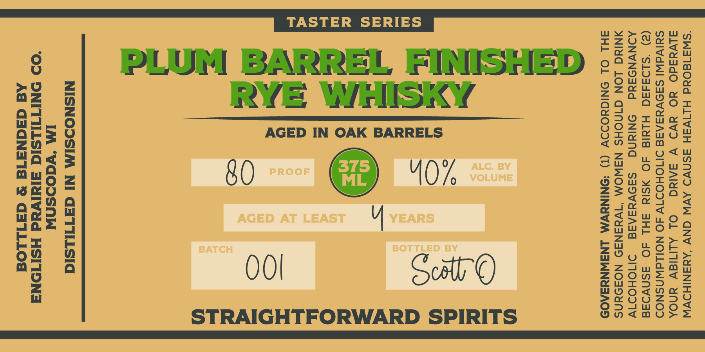

# TTB COLA Label Images - TTBID 26070001000283

**Brand Name:** PLUM BARREL FINISHED RYE WHISKY

**Issue Date:** 03/20/2026

**Origin Code:** 48

**Product Class/Type:** 142

**Source:** [TTB Public COLA Registry](https://ttbonline.gov/colasonline/viewColaDetails.do?action=publicFormDisplay&ttbid=26070001000283)

## Label Images

### Label 1

### Label 2

## Extracted Label Text

*Text extracted via OCR - may contain errors*

### Label 1

“SW3180Ud HLIVSH ASNVD AVW GNV ‘AYNSNIHDVW
divdadO YO avd V SAING) OL ALIMIEV YNOA
SUIVdWI SA9VESAAE DIIOHOITV 4O NOILWNSNOD
(2) ‘SLD3d50 HLYId 4O ASIN AHL AO ASNVIAE
ADNVNODAYd ONINNG Ss9VesAaE DIMOHOD1V
NING LON GINOHS NSWOM “1WyeaN39 NOF9aNS
AHL OL SNIGYODDV (1) *SNINYVM LNSWNYZA09S
NISNODSIM NI GaTILsid

‘OO ONITIHLSIC aldivad HSITONA
Ad GaqNaATd & GaILLOd

©

A)

om

2)

S_
@

AGED IN OAK BARRELS

OO
STRAIGHTFORWARD SPIRITS

80

### Label 2

STRAIGHT FORWARD SPIRITS
1
37d03dadvMdO-LHOIvALS
STRAIGHTFORWARD
PEOPLE
3
SLiylds @avmgo_
LHOivaLS
8
