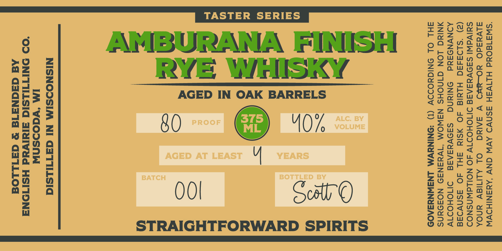

# TTB COLA Label Images - TTBID 26070001000292

**Brand Name:** AMBURANA FINISH RYE WHISKY

**Issue Date:** 03/17/2026

**Origin Code:** 48

**Product Class/Type:** 142

**Source:** [TTB Public COLA Registry](https://ttbonline.gov/colasonline/viewColaDetails.do?action=publicFormDisplay&ttbid=26070001000292)

## Label Images

### Label 1

### Label 2

## Extracted Label Text

*Text extracted via OCR - may contain errors*

### Label 1

“SW3180Ud HLIVSH ASNVD AVW GNV ‘AYNSNIHDVW
divdadO YO-8¥O V SAINd) Ol ALIMIEV YNOA
SUIVdWI SA9VESAAE DIIOHOITV 4O NOILWNSNOD
(2) ‘SLD3d50 HLYId 4O ASIN AHL AO ASNVIAE
ADNVNODAYd ONINNG Ss9VesAaE DIMOHOD1V
NING LON GINOHS NSWOM “1WyeaN39 NOF9aNS
AHL OL SNIGYODDV (1) *SNINYVM LNSWNYZA09S

©

A)

o~

a)

=
@>

AGED IN OAK BARRELS

80

OO
STRAIGHTFORWARD SPIRITS

NISNODSIM NI GaTILsid

IM ‘YWaOoSnW
‘OO ONITIHLSIC aldivad HSITONA
Ad GaqNaATd & GaILLOd

### Label 2

STRAIGHT FORWARD SPIRITS
1
37d03dadvMdO-LHOIvALS
STRAIGHTFORWARD
PEOPLE
3
SLiylds @avmgo_
LHOivaLS
8
