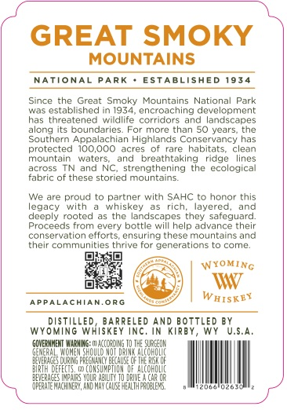
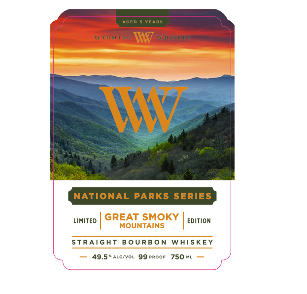

# TTB COLA Label Images - TTBID 26070001000404

**Brand Name:** WYOMING WHISKEY

**Fanciful Name:** GREAT SMOKY MOUNTAINS

**Issue Date:** 03/19/2026

**Origin Code:** 49

**Product Class/Type:** 101

**Source:** [TTB Public COLA Registry](https://ttbonline.gov/colasonline/viewColaDetails.do?action=publicFormDisplay&ttbid=26070001000404)

## Label Images

### Back Label

### Front Label

## Extracted Label Text

*Text extracted via OCR - may contain errors*

**Detected Proof:** 99
**Detected Age:** 50 Years

### Back Label

GREAT SMOKY
MOUNTAINS
NATIONAL
PARK
ESTABLISHED 1934
Since
the Great Smoky Mountains National
Park
Mee
established
1934
encroaching dlevelopment
has threatened wildlife corridors and landscapes
along its boundaries
more than 50 years
the
Southern Appalachian Highlands Conservancy has
protected
10O,000
ecres
of rare
habitats
clean
mountain
walers;
Anc
breathtaking
riage
lines
across
ano
NC;
strengthening
the ecologica
rabric ot these storied mountains
We are proud t0 partner with SAHC t0 honor this
edacy
with
whiskey
rich
layerea
and
deeci
rooted
as thc landscapes they sateguard:
Proceeds
from every bottle will help advance their
conservation efforts ensuring these mountains and
their communities tnrive tor generations to come
WYoMiNG
APPALACHIAN.ORG
W HISKTY
WYO
RUTG 4EDHbk PEnEr
INC _
ANriATTHED
S.A,
GQVE; VHERT WarMin
Na |O THE SRLCOH
AUcOHOUC
BTVERACCS
PREGRIH YCY^
Mpiun
DEFECII
COHIU
CAR OR
VEMNCHIHE3 , AND HAYC
HEALTH
FaCE Or
Fot

### Front Label

AGED
YeaRs
WXomNG
W
WMI$k />
MAw
NATIONAL
PARKS SERIES
LIMITED
GREAT SMOKY
EDitiOn
MOUNTAINS
STRAIGAT
B OURBON
WhISKE
49.5*ALc/VOL 99 Proof
750 ML
