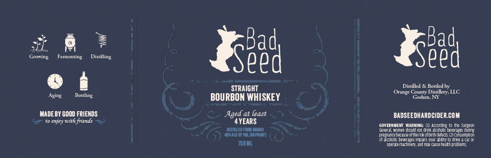

# TTB COLA Label Images - TTBID 26070001000406

**Brand Name:** BAD SEED BOURBON WHISKEY

**Issue Date:** 03/12/2026

**Origin Code:** 02

**Product Class/Type:** 101

**Source:** [TTB Public COLA Registry](https://ttbonline.gov/colasonline/viewColaDetails.do?action=publicFormDisplay&ttbid=26070001000406)

## Label Images

### Label 1

## Extracted Label Text

*Text extracted via OCR - may contain errors*

**Detected Age:** 4 Years

### Label 1

Growing
Femmenting
SBed
Seed
STRAIGHT
Distilkd
Bortked by
Orange County Distilkry LLC
Aging
Bottling
BOURBON WHISKEY
Lgoshcn_
MADE BY GOOD FRIENDS
Aged at least
BADSEEDHARDCIDER.COM
enjoy with friends
4YEARS
GOVERNMEMT MARNING
Acondrg
Ite Surze n
DSILEFEL
Fntnit
Geifal, women #iould nct dink alcchlic texerape; dunne
Hokaicm M[amot
gancbeaeeofthera ehlrthd-fedt
Fengummien
Eatloll Motennz Imoe
Your  bllcy ( drwe
T50uL
@derztomeehimereaMMetQiseeath dtolems
Distiling
