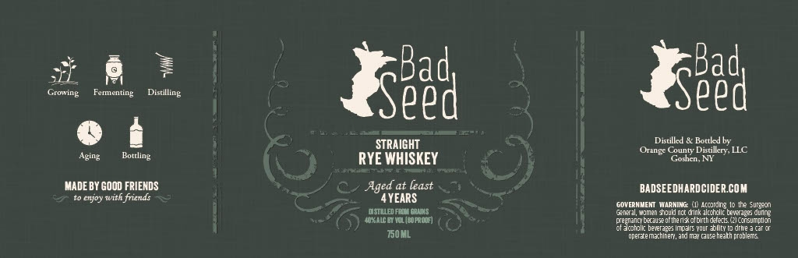

# TTB COLA Label Images - TTBID 26070001000413

**Brand Name:** BAD SEED RYE WHISKEY

**Issue Date:** 03/12/2026

**Origin Code:** 02

**Product Class/Type:** 102

**Source:** [TTB Public COLA Registry](https://ttbonline.gov/colasonline/viewColaDetails.do?action=publicFormDisplay&ttbid=26070001000413)

## Label Images

### Label 1

## Extracted Label Text

*Text extracted via OCR - may contain errors*

**Detected Age:** 4 Years

### Label 1

Growing
Fementing
Seed
Seed
STRAIGHT
Distilled
Bortled by
Orange County Distilkery LLC
Aging
Bottling
RYE WHISKEY
Ggoshcn Ni
MADE BY GOOD FRIENDS
Aged at least
BADSEEDHARDCIDER.COM
enjoy with friends
4YEARS
GOVERNMEMT MARNING
Acondig
Ite Surgecn
DSTULED FRoY CoNNS
TeRn
omen fiould nct dink alcchellc teverape; dunne
HOALC M Ia [MPROTF)
enancbeal eoftheria utlnhd fed
Fencummien
Hatholk haten * Imoe
Your  bllcy ( drwe
T50ML
odertemeehner  aMMmetQisaheaith dtoblems
Distiliog
