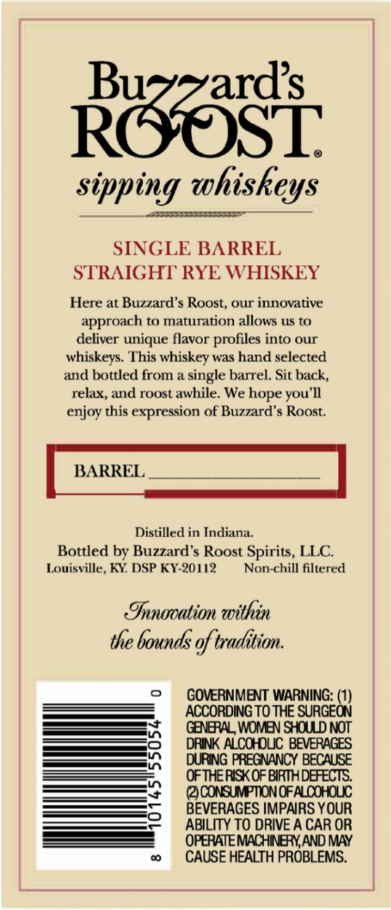
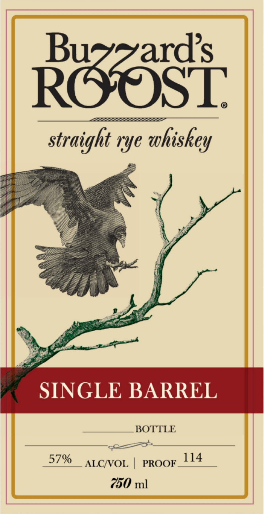

# TTB COLA Label Images - TTBID 26070001000498

**Brand Name:** BUZZARD'S ROOST

**Fanciful Name:** BUZZARD'S ROOST SINGLE BARREL RYE WHISKEY

**Issue Date:** 03/13/2026

**Origin Code:** 22

**Product Class/Type:** 102

**Source:** [TTB Public COLA Registry](https://ttbonline.gov/colasonline/viewColaDetails.do?action=publicFormDisplay&ttbid=26070001000498)

## Label Images

### Back Label

### Front Label

## Extracted Label Text

*Text extracted via OCR - may contain errors*

**Detected Proof:** 114

### Back Label

Raosi
sipping whiskeys
SINGLE BARREL
STRAIGHT RYE WHISKEY
Here at Buzzard $ Roost, our innovative
approach to maturation allows uS to
deliver unique flavor profiles into our
whiskeys. This whiskey was hand selected
and bottled from a single barrel. Sit back,
relax, and roost awhile: We hope you']l
enjoy this expression of Buzzard'$ Roost.
BARREL
Distilled in Indiana
Bottled by Buzzard $ Roost Spirits, LLC
Louisville, KY DSP KY-20112
Non-chill filtered
Iooation within
the bounds of tradtion.
GOVERNMENT WARNING: (1)
ACCORDING TO THE SURGEON
GENERAL WOMEN SHOULD NOT
8
DRINK ALCOHOUC BEVERAGES
DURING PREGNANCY BECAUSE
OFTHE RISK OF BIRIHDEFECTS;
4
@CONSUMPTIONOFALOOHOLCC
BEVERAGES IMPAIRS YOUR
ABILITY TO DRIVE A CAR OR
OPERATEMACHNEYAND MAY
00
CAUSE HEALTH PROBLEMS.

### Front Label

Raoosi
rye
whiskey
SINGLE BARREL
BOTTLE
57%
114
ALCNOL
PROOF
750 ml
straight
