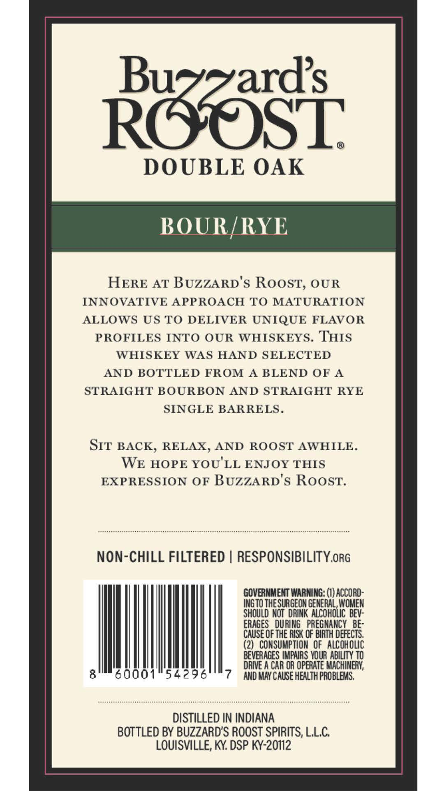
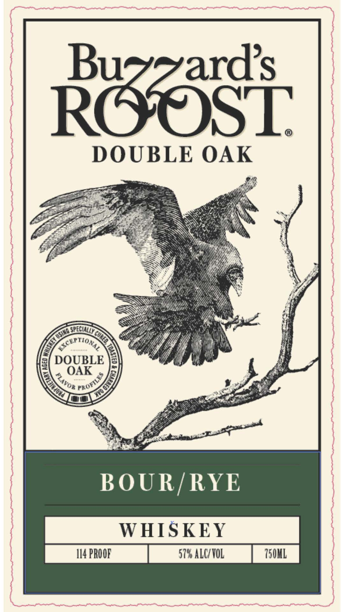

# TTB COLA Label Images - TTBID 26070001000522

**Brand Name:** BUZZARD'S ROOST

**Fanciful Name:** BUZZARD'S ROOST BOUR/RYE WHISKEY

**Issue Date:** 03/18/2026

**Origin Code:** 22

**Product Class/Type:** 140

**Source:** [TTB Public COLA Registry](https://ttbonline.gov/colasonline/viewColaDetails.do?action=publicFormDisplay&ttbid=26070001000522)

## Label Images

### Back Label

### Front Label

## Extracted Label Text

*Text extracted via OCR - may contain errors*

**Detected Proof:** 114

### Back Label

Razsi
DOUBLE OAK
BOUR/RYE
HERE AT BUzZARD'$ RoosT; OUR
INNOVATIVE APPROACH T0 MATURATION
ALLOWS US TO DELIVER UNIQUE FLAVOR
PROFILES INTO OUR WHISKEYS. THIS
WHISKEY WAS HAND SELECTED
AND BOTTLED FROM A BLEND OF A
STRAIG HT BOURBON AND STRAIGHT RYE
SINGLE BARRELS.
SIT BACK, RELAX, AND ROOST AWHILE.
WE HOPE YOU'LL ENJOY THIS
EXPRESSION OF BUzZARD's RoosT:
NOn-CHILL FILTERED
RESPONSIBILITY.ORG
GOVERNMENT WARNING: (1) ACCORD:
INGTO THESURGEON GENERAL, WOMEN
should NOT  DRINK AlCohOLIC  Bev:
ERAGES   DURING   PREGNANCY   Be;-
CauSe OF the RISK OF BIRTH defects,
(2)   CONSUMPTION  OF alcoholic
BEVERAGES IMPAIRS VOUR ABiLITY TO
DRIVE A CAR OR OpeRATE MACHINERN,
8
60001
54296
7
AND MaY Cause health PROBLEMS,
DISTILLED IN INDIANA
BOTTLED BY BUZZARDS ROOST SPIRITS, LL.C
LOUISVILLE; KY: DSP KY-20112

### Front Label

Raasi
DOUBLE OAK
EREcwU
DOUBLE
OAK
BOUR/RYE
WHISKEY
114 PROOF
5798 ALC/VOL
I50KL
Fusing
KP Hop
FROFILE ?
PLAVOR
Kudd
