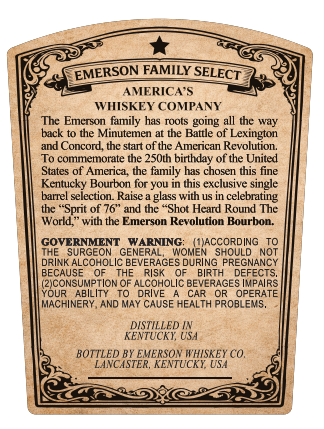
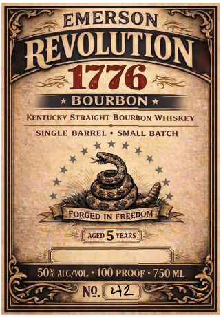

# TTB COLA Label Images - TTBID 26070001000584

**Brand Name:** EMERSON

**Issue Date:** 03/12/2026

**Origin Code:** 22

**Product Class/Type:** 101

**Source:** [TTB Public COLA Registry](https://ttbonline.gov/colasonline/viewColaDetails.do?action=publicFormDisplay&ttbid=26070001000584)

## Label Images

### Back Label

### Front Label

## Extracted Label Text

*Text extracted via OCR - may contain errors*

**Detected Proof:** 100

### Back Label

EMERSON FAMILY
AMERICA S
WISKEY COMPANY
The Emcrson family has roots going all the way
back to the Minutemen at the Battle of Lexington
and Concord, thc start of thc Amcrican Revolution:
To commemorate the 2SOth birthday of the United
States of America; the family has chosen this fine
Kentucky Bourbon for yu in this exclusive single
barrel selection Raise a glass with -
in celebrating
thc "Sprit of 76'
the "Shot Heard Round The
World "
with the Emerson Revolution Bourbon:
GOVERNMENT
WARNING:
NGOWEACCORDWG
SURGEON
GENERAL,
SHOULD NoT
DRINK ALCOHOLIC BEVERAGES DURING PREGNANCY
BECAUSE
THE
RiSk
BIRTH
DEFECTS,
(ZICONSUMPTION OF ALCOHOLIC BEVERAGES IMPAIRS
YOUR
ABILITY
DRIVE
CAR
OPERATE
MACHINERY, AND MaY CAUSE HEALTH PROBLEMS,
DISTILLED
KENTUCKI; USA
BOTTLED BX EVERSOX WHISKEY CO,
LANCASTER, KENTUCKI USA
SELECT

### Front Label

EMERSON
REVOLUTION
7776
BOURBON
KENTUCKY STRAIGHT BOURBON WHISKEY
SINGLE BARREL
SMALL BATCH
FORGED IN FREEDOM
AGED
5 VEARS
50" ALC/VOL.
100 PROOF + 750 ML
NQ
42
