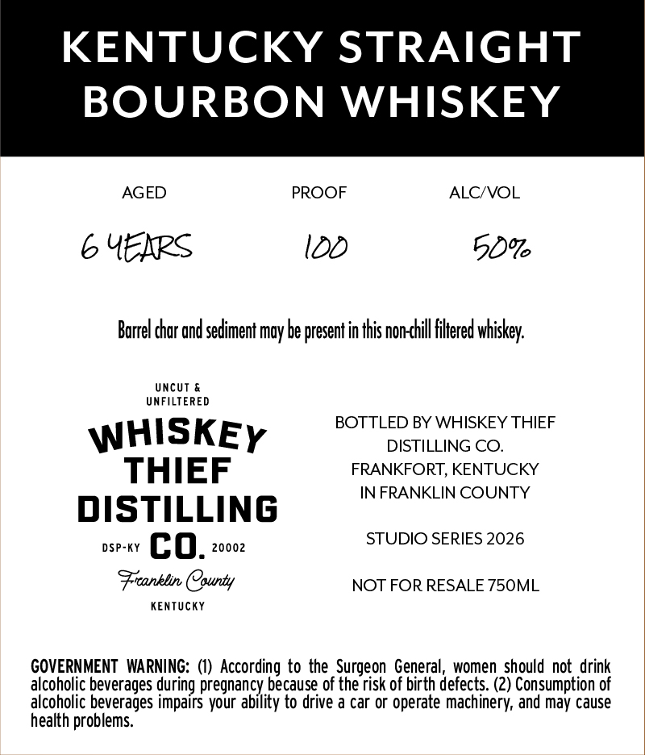
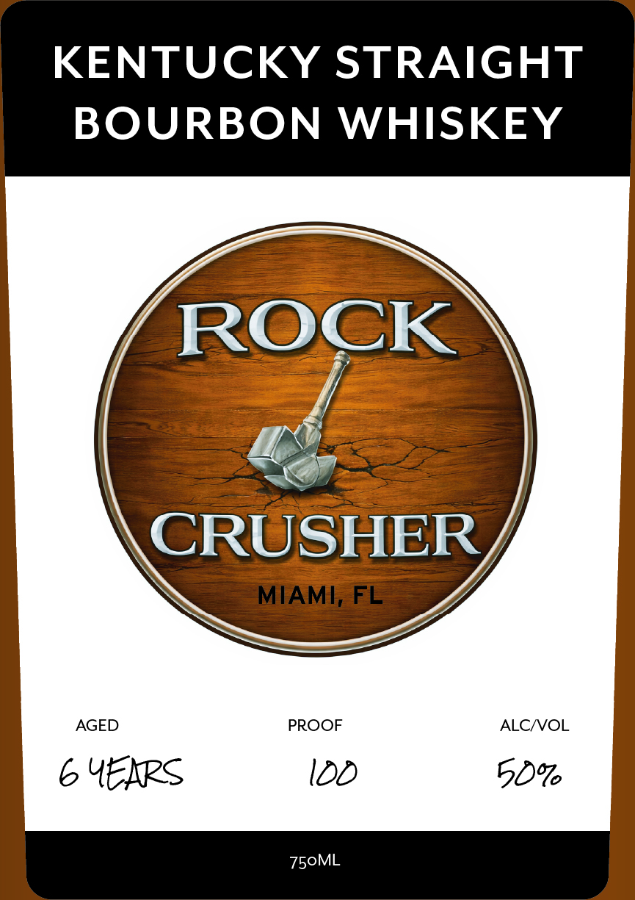

# TTB COLA Label Images - TTBID 26070001000692

**Brand Name:** WHISKEY THIEF DISTILLING CO.

**Fanciful Name:** ROCK CRUSHER

**Issue Date:** 03/12/2026

**Origin Code:** 22

**Product Class/Type:** 101

**Source:** [TTB Public COLA Registry](https://ttbonline.gov/colasonline/viewColaDetails.do?action=publicFormDisplay&ttbid=26070001000692)

## Label Images

### Back Label

### Front Label

## Extracted Label Text

*Text extracted via OCR - may contain errors*

### Back Label

KENTUCKY STRAIGHT

BOURBON WHISKEY

AGED PROOF ALC/VOL

6 UERRS 100 50%

Barrel char and sediment may be present in this non-chill filtered whiskey.

UNFILTERED
BOTTLED BY WHISKEY THIEF
WHISKEy DISTILLING CO.

THIEF FRANKFORT, KENTUCKY

IN FRANKLIN COUNTY

DISTILLING

ose-ry (OQ, 20002 STUDIO SERIES 2026

Franklin County NOT FOR RESALE 750ML

KENTUCKY

GOVERNMENT WARNING: (1) According to the Surgeon General, women should not drink
alcoholic beverages during pregnancy because of the risk of birth defects. (2) Consumption of
alcoholic beverages impairs your ability to drive a car or operate machinery, and may cause
health problems.

### Front Label

KENTUCKY STRAIGHT

BOURBON WHISKEY

C

a

CRU

Ss

AGED

PROOF

ALC/VOL

6 YEKRS

l00

5O%

750ML
