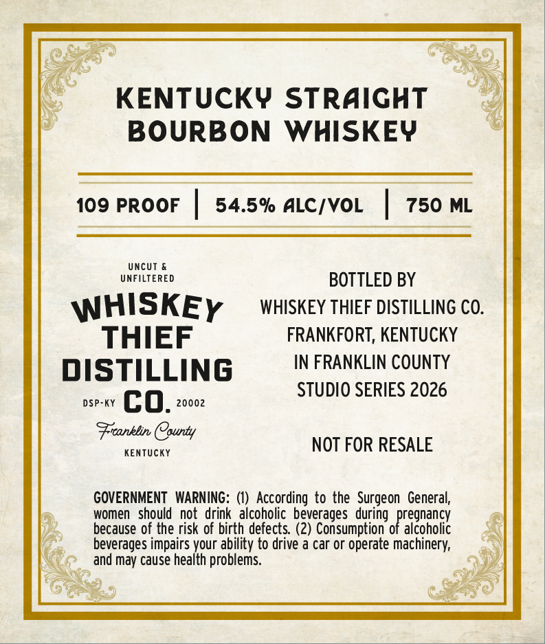
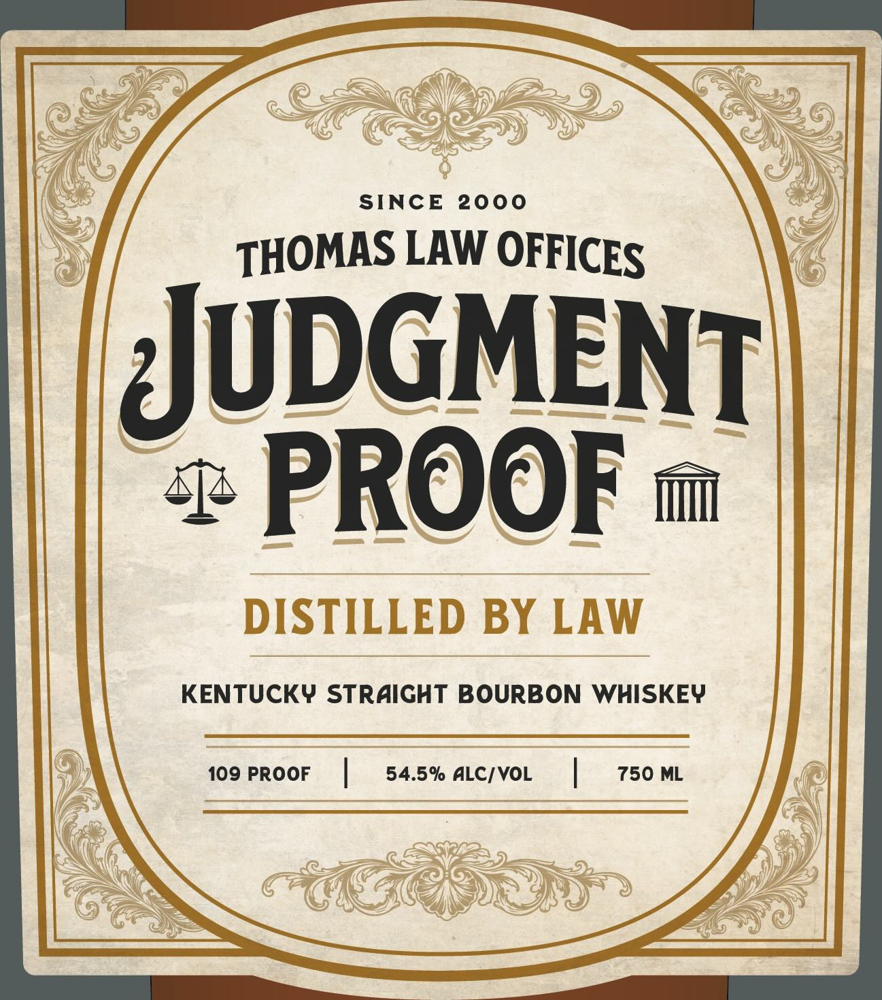
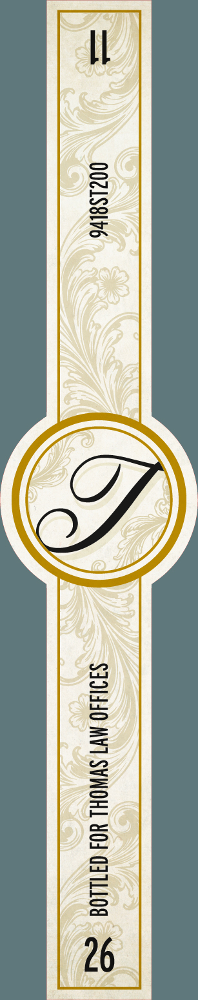

# TTB COLA Label Images - TTBID 26070001000702

**Brand Name:** WHISKEY THIEF DISTILLING CO.

**Fanciful Name:** JUDGEMENT PROOF

**Issue Date:** 03/12/2026

**Origin Code:** 22

**Product Class/Type:** 101

**Source:** [TTB Public COLA Registry](https://ttbonline.gov/colasonline/viewColaDetails.do?action=publicFormDisplay&ttbid=26070001000702)

## Label Images

### Back Label

### Front Label

### Label 3

## Extracted Label Text

*Text extracted via OCR - may contain errors*

*1 image(s) excluded: text did not meet readability threshold*

**Detected Proof:** 109

### Back Label

KENTUCKY STRAIGHT
BOURBON WHISKEY

109 PROOF | 54.5% ALC/VOL | 750 ML

UNCUT &

UNFILTERED BOTTLED BY

WHISKEy __ wiskey THieF DistILuNG co.
THIEF FRANKFORT, KENTUCKY

DISTILLING IN FRANKLIN COUNTY
STUDIO SERIES 2026
DSP-KY co. 20002

eel Coe NOT FOR RESALE

KENTUCKY

GOVERNMENT WARNING: (1) According to the Surgeon General,

women should not drink alcoholic beverages during pregnancy

because of the risk of birth defects. (2) Consumption of alcoholic

beverages impairs your ability to drive a car or operate machinery,
» and may cause health problems.

### Front Label

SINCE
2000
LAW OFFICES
UuDGMENT
PROOF
DISTILLED BY LAW
KENTUCKY STRAIGHT BOURBON WHISKEY
109 PROOF
54.5% ALC/ VOL
750 ML
THOMAS
