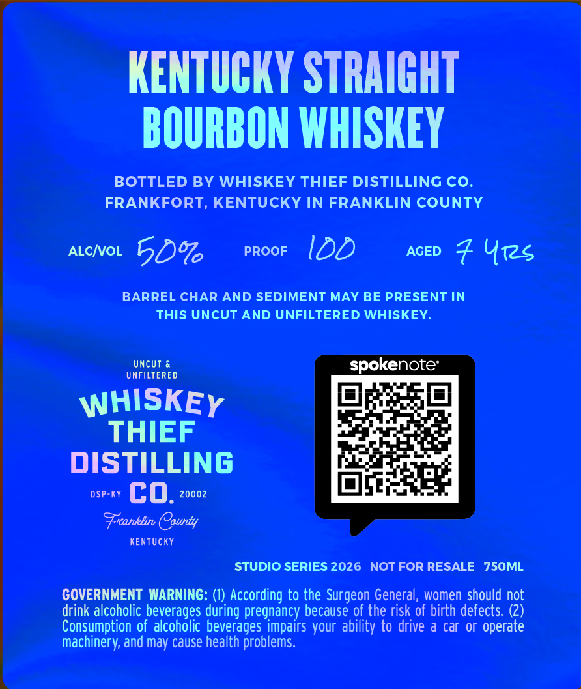
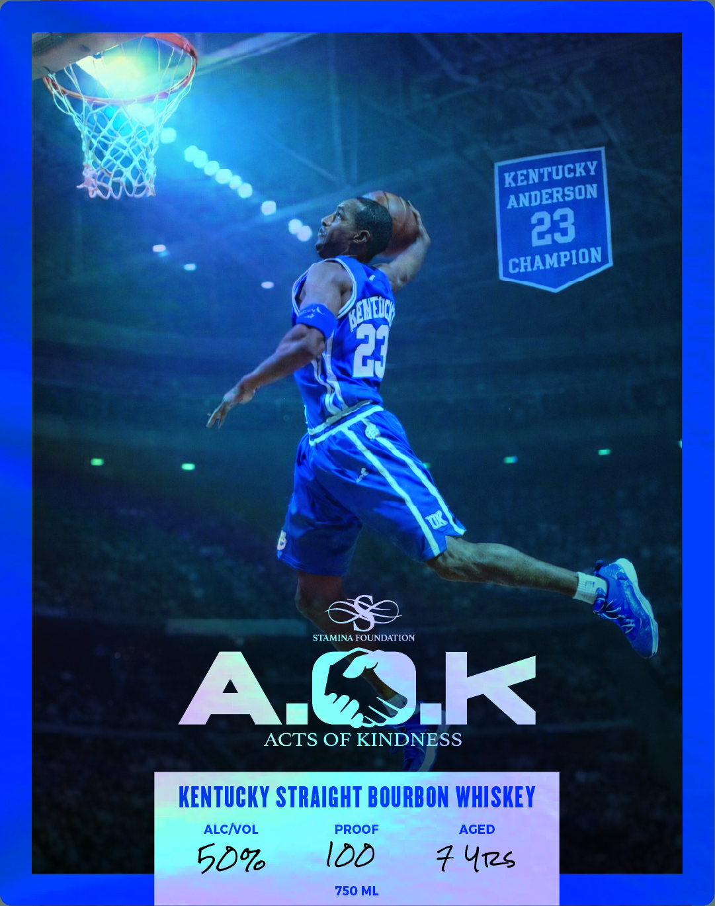

# TTB COLA Label Images - TTBID 26070001000706

**Brand Name:** WHISKEY THIEF DISTILLING CO.

**Fanciful Name:** ACTS OF KINDNESS

**Issue Date:** 03/12/2026

**Origin Code:** 22

**Product Class/Type:** 101

**Source:** [TTB Public COLA Registry](https://ttbonline.gov/colasonline/viewColaDetails.do?action=publicFormDisplay&ttbid=26070001000706)

## Label Images

### Back Label

### Front Label

## Extracted Label Text

*Text extracted via OCR - may contain errors*

**Detected Proof:** 100

### Back Label

KENTUCKY STRAIGHT
BOURBON WHISKEY
BOTTLED BY WHISKEY THIEF DISTILLING CO
FRANKFORT, KENTUCKY IN FRANKLIN COUNTY
ALCIvOL
50%
PROOF
IDD
AGED
% U1s
BARREL CHAR AND SEDIMENT MAY BE PRESENT IN
THIS UNCUT AND UNFILTERED WHISKEY.
Uncut &
UNFILTERED
WHISKEY
THIEF
DISTILLING
DSP-KY
co.
20002
Frcanklin County
KenTUcKY
STUDIO SERIES 2026
NOT FOR RESALE
750ML
GOVERNMENT  WARNING: (1) According to the Surgeon General, women should not
drink alcoholic beverages during pregnancy because of the risk of birth defects: (2)
Consumption of alcoholic beverages impairs your ability to drive a car or operate
machinery; and may cause health problems:

### Front Label

23
21
STAMINA FOUNDATION
Azc
K
AcTS OF KINDN
SS
KENTuCKY STRAIGHT BOURBON WHISKEY
ALCNOL
PROOF
AGED
750 ML
KENTUCKY
ANDERSON
CHAMPION
BeNEUg
