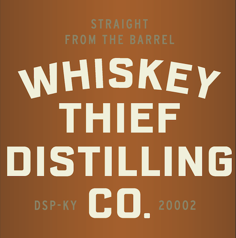
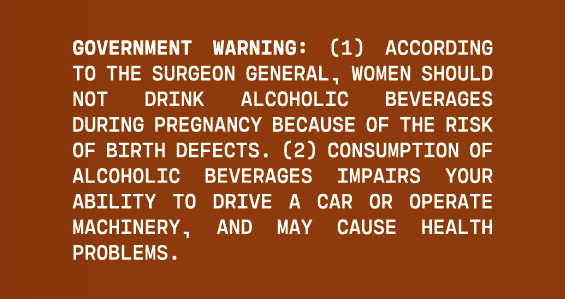

# TTB COLA Label Images - TTBID 26070001000738

**Brand Name:** WHISKEY THIEF DISTILLING CO.

**Issue Date:** 03/12/2026

**Origin Code:** 22

**Product Class/Type:** 101

**Source:** [TTB Public COLA Registry](https://ttbonline.gov/colasonline/viewColaDetails.do?action=publicFormDisplay&ttbid=26070001000738)

## Label Images

### Label 1

### Label 2

### Label 3

### Label 4

## Extracted Label Text

*Text extracted via OCR - may contain errors*

*1 image(s) excluded: text did not meet readability threshold*

**Detected Proof:** 130

### Label 1

ALcIvoL
PROOF
THIEVED
AGE IN YEARS
BBL
WHISKEYTHIEECOM
65%
120
AuGust 1D25
6 YEATs
2-412
KENTUCKY STRAIGHT
{aunbon
HAND-THIEVED
MASHBILL
750ML
BOTTLED BY
WOMEN
WHISKEY THIEF DISTILLING
BOURBON WHISKEY
Uncut & UNFILTERED
IDC /15RI51
FRANKFORT
FRAORLINKCOUNTKY
COUNTY

### Label 2

STRAIGHT
FROM THE BARREL
WHISKEY
THIEF
DISTILLING
DSP-KY
co.
20002

### Label 4

GOVERNMENT
WARNING :
(1)
ACCORDING
To THE SURGEON GENERAL ,
WOMEN SHOULD
NOT
DRINK
ALCOHOLIC
BEVERAGES
DURING PREGNANCY BECAUSE OF
THE RISK
OF BIRTH DEFECTS. (2) CONSUMPTION OF
ALCOHOLIC
BEVERAGES
IMPAIRS
YOUR
ABILITY
To
DRIVE
CAR
OR
OPERATE
MACHINERY
AND
MAY
CAUSE
HEALTH
PROBLEMS _
