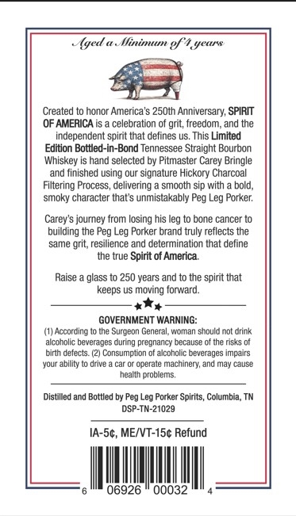
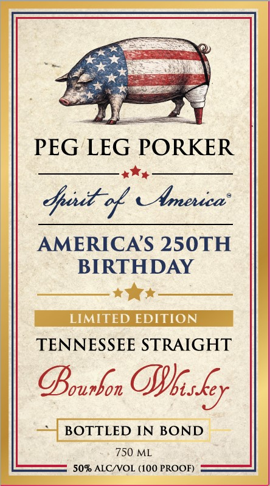

# TTB COLA Label Images - TTBID 26070001000914

**Brand Name:** PEG LEG PORKER

**Issue Date:** 03/18/2026

**Origin Code:** 43

**Product Class/Type:** 111

**Source:** [TTB Public COLA Registry](https://ttbonline.gov/colasonline/viewColaDetails.do?action=publicFormDisplay&ttbid=26070001000914)

## Label Images

### Back Label

### Front Label

## Extracted Label Text

*Text extracted via OCR - may contain errors*

**Detected Proof:** 100

### Back Label

{ged &   Ilinimum gf* !years
Created to honor America's 250th Anniversary; SPIRIT
OF AMERICA is
celebration of grit;, freedom; and the
independent spirit that defines us. This Limited
Edition Bottled-in-Bond Tennessee Straight Bourbon
Whiskey is hand selected by Pitmaster Carey Bringle
and finished using our signature Hickory Charcoal
Filtering Process, delivering
smooth sip with =
bold_
smoky character that'$ unmistakably Peg Leg Porker:
Carey's journey from losing his leg to bone cancer to
building the Peg Leg Porker brand -
reflects the
same grit, resilience and determination that define
the true Spirit of America
glass to 250 years and to the spirit that
keeps us moving forward
GOVERNMENT WARNING:
(1) According
(he Surgeon General
Vomtam
shoulad not drink
aiccnoic
beverages during pregnancy because of the risks of
birh defects
Consumption ,
alcoholic beverages impairs
your abllity
rive
operale Machinery; and ma} cause
health problems;
Distilled and Bottled by Peg Leg Porker Spirits, Columbia, TM
DSP-TN-21029
IA-Sc, MEIVT-15c Refund
0003
truly
Raise

### Front Label

PEG LEG PORKER
Ipt %
Abrenica"
AMERICAS 250TH
BIRTHDAY
LIMITED EDITION
TENNESSEE STRAIGHT
GBoupbon Oskey
BOTTLED IN
BOND
750 ML
50% ALCIVOL (100 PROOF)
