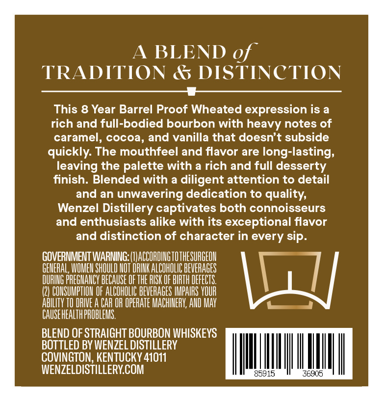
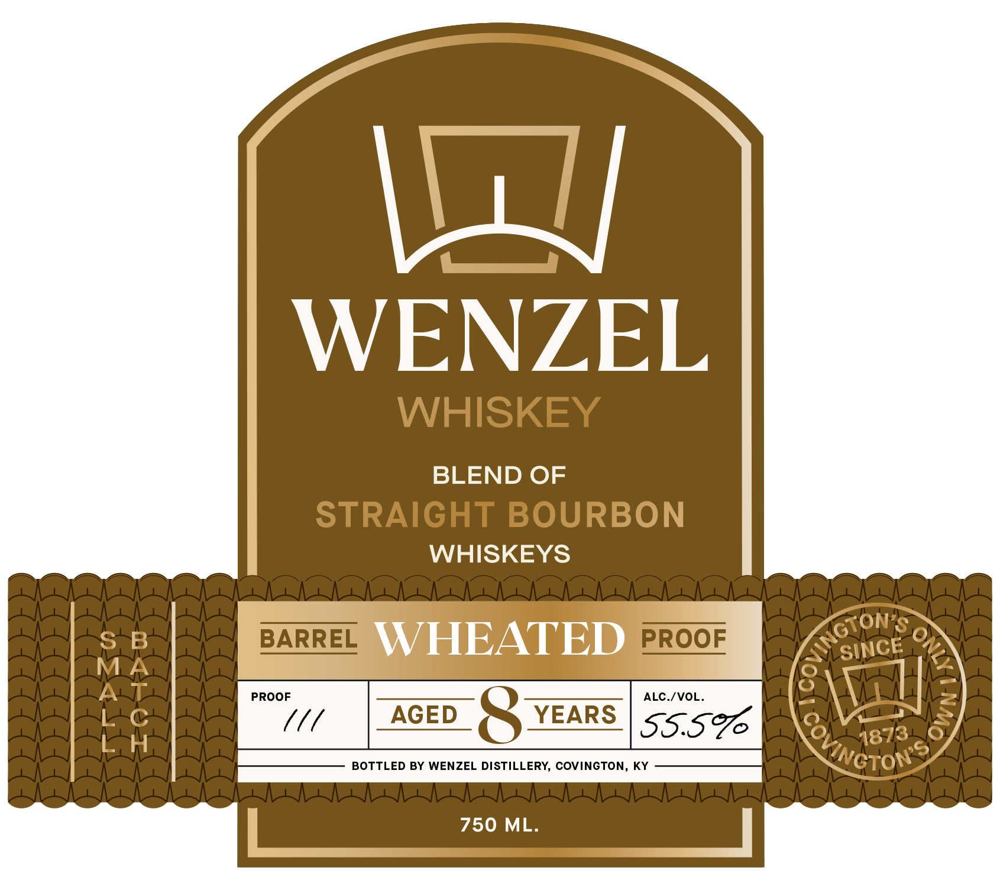
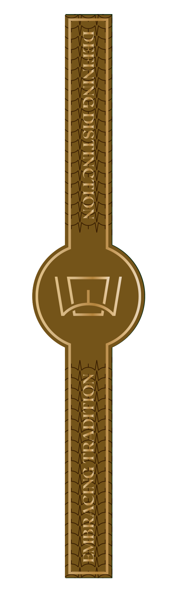

# TTB COLA Label Images - TTBID 26070001000976

**Brand Name:** WENZEL DISTILLERY

**Issue Date:** 03/13/2026

**Origin Code:** 22

**Product Class/Type:** 121

**Source:** [TTB Public COLA Registry](https://ttbonline.gov/colasonline/viewColaDetails.do?action=publicFormDisplay&ttbid=26070001000976)

## Label Images

### Back Label

### Label 1

### Label 3

## Extracted Label Text

*Text extracted via OCR - may contain errors*

*1 image(s) excluded: text did not meet readability threshold*

**Detected Age:** 8 Years

### Back Label

A BLEND of
TRADITION & DISTINCTION
This 8 Year Barrel Proof Wheated expression is a
rich and full-bodied bourbon with heavy notes of
caramel, cocoa, and vanilla that doesn't subside
quickly The mouthfeel and flavor are long-lasting;
leaving the palette with a rich and full desserty
finish. Blended with
diligent attention to detail
and an unwavering dedication to quality;
Wenzel Distillery captivates both connoisseurs
and enthusiasts alike with its
exceptional flavor
and distinction of character in every sip.
GOVERNMENT WARNING: (WACCORDINGTOTHESURGEOH
GEMERAL, WOMEH SHOULD HOT RIHK ALCOHOLIC BEVERAGES
DURING PREGHAHCY BECAUSE OF THE RISK OF BIRTH DEFECTS
(2) COHSUMPTIOH OF ALCOHOLIC BEVERAGES IMPAIRS VOUR
AbILITY TO DRIVE A CAR OR OPERATE MACHINERV; AVD MAY
CAUSEHEALTHPROBLEMS
BLEND OF STRAIGHT BOURBON WHISKEYS
BOTTLED BY WENZEL DISTILLERY
COVINGTON, KENTUCKY 41011
WENZELDISTILLERYCOM
85915
36905

### Label 1

V4
WENZEL
WHISKEY
BLEND OF
STRAIGHT BOURBON
WHISKEYS
8
B
BARREL
WHEATED
PROOF
PROOF
ALC./VOL_
AGED
8
YEARS
SS.S9
1873
BOTTLED BY WENZEL DISTILLERY, COVINGTON, KY
750 ML.
KNGTON
3
SINCE
Covincto /
