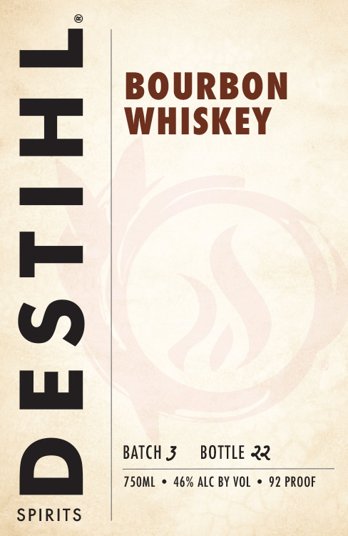
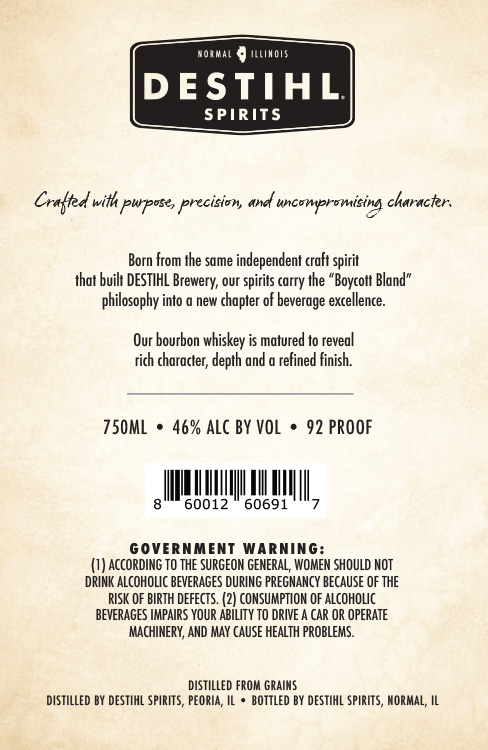

# TTB COLA Label Images - TTBID 26070001001052

**Brand Name:** DESTIHL SPIRITS BOURBON WHISKEY

**Issue Date:** 03/12/2026

**Origin Code:** 04

**Product Class/Type:** 141

**Source:** [TTB Public COLA Registry](https://ttbonline.gov/colasonline/viewColaDetails.do?action=publicFormDisplay&ttbid=26070001001052)

## Label Images

### Label 1

### Label 2

## Extracted Label Text

*Text extracted via OCR - may contain errors*

**Detected Proof:** 92

### Label 1

BOURBON

WHISKEY

BATCH 3

BOTTLE 22

TSOML * 46% ALC BY VOL * 92 PROOF x

Q

SPIRITS

### Label 2

Noimai
JILimOTS
DESTIHL
SPIRITS
Craltd with pwposes precision
uncompramising characker:
Born from Ihe same independent craft spirit
that buik DESTIHL
our
spirils carry Ihe "Boycolt Bland"
philosophy into
new chapter of beverage excellence_
Our bourbon whiskey is matured to reveal
rich character; depth and
refined finish.
750mL
46% ALC BY VoL
92 PROOF
60012
60691
GOVERNMENT
WaRniNG:
ACcORDING TO THE SURGEON GENERAL, WOMEM SHOULD NOT
DRINK ALCOHOLIC BEVERAGES DURING PREGNANCY BecauSe OF The
RISK OF BIRTH dEFECTS .
CONSUMPTION OF alcohoLc
BEVERAGES HMPAIRS YOUR AbILITY To DRIVE _
CAR OR OPERATE
MachinerY, AND MAY CAUSE HEALTH problems.
distilled From GRAIMS
distilled BY deStIhL spirITs, PEOria
bOTTLEd BY DESTIHL SpIRITS, MORMAL; IL
ane
Brewery;
