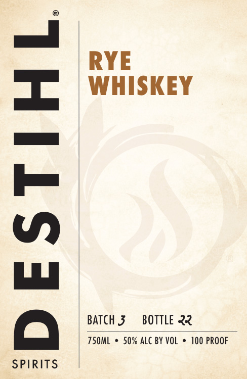
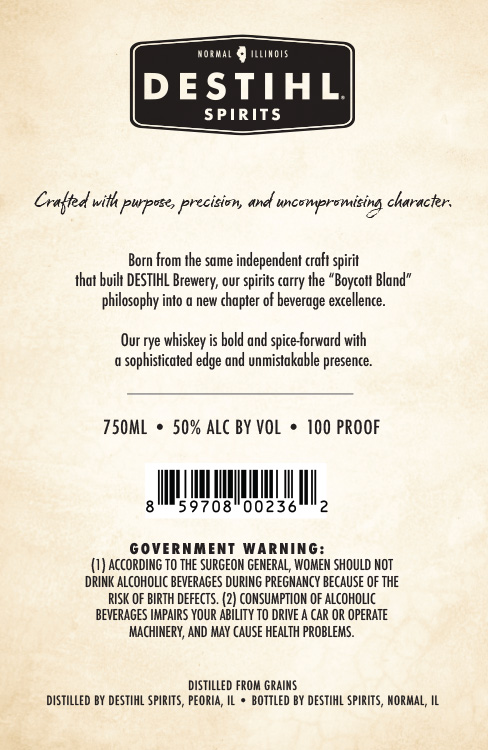

# TTB COLA Label Images - TTBID 26070001001053

**Brand Name:** DESTIHL SPIRITS RYE WHISKEY

**Issue Date:** 03/12/2026

**Origin Code:** 04

**Product Class/Type:** 142

**Source:** [TTB Public COLA Registry](https://ttbonline.gov/colasonline/viewColaDetails.do?action=publicFormDisplay&ttbid=26070001001053)

## Label Images

### Label 1

### Label 2

## Extracted Label Text

*Text extracted via OCR - may contain errors*

**Detected Proof:** 100

### Label 1

RYE
WHISKEY
1
BATch 3
BOTTLE ?
750ML
50% alc BY VoL
100 PROOF
SPIRITS

### Label 2

Noimai
JILimOTS
DESTIHL
SPIRITS
Craltd with pwposes precision
uncompramising characker:
Born from Ihe same independent craft spirit
that buik DESTIHL
our
spirils carry Ihe "Boycolt Bland"
philosophy into
new chapter of beverage excellence_
Our rye whiskey is bold and spice-forward with
sophisticated edge and unmistakable presence:
750mL
50% Alc BY VoL
100 PROOF
59708"00236
GOVERNMENT
WaRniNG:
ACcORDING TO THE SURGEON GENERAL, WOMEM SHOULD NOT
DRINK ALCOHOLIC BEVERAGES DURING PREGNANCY BecauSe OF The
RISK OF BIRTH dEfeCTS. (2| CONSUMPTION OF alcoholc
BEVERAGES HMPAIRS YOUR AbILITY To DRIVE _
CAR OR OPERATE
MachinerY, AND MAY CAUSE HEALTH problems.
distilled From GRAIMS
distilled BY deStIhL spirITs, PEOria
bOTTLEd BY DESTIHL SpIRITS, MORMAL; IL
ane
Brewery;
