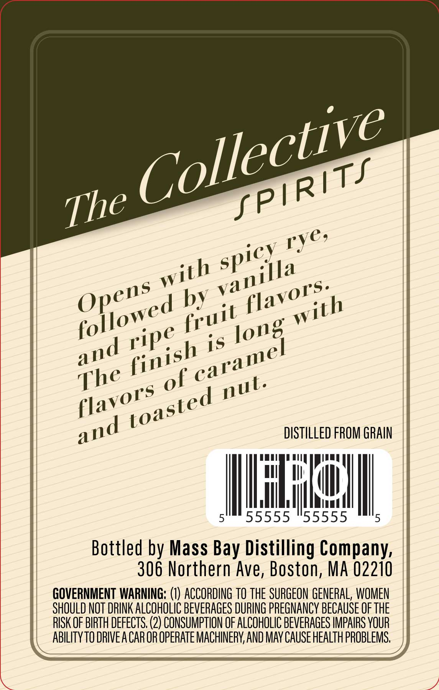
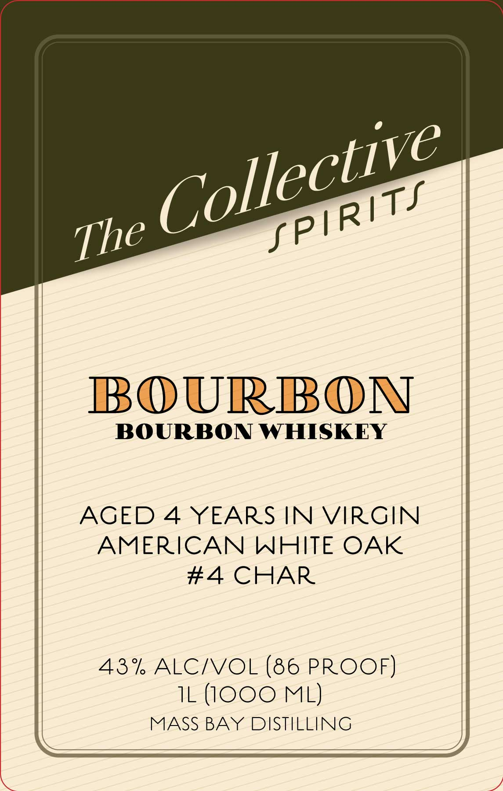

# TTB COLA Label Images - TTBID 26070001001103

**Brand Name:** BOURBON

**Issue Date:** 03/20/2026

**Origin Code:** 26

**Product Class/Type:** 141

**Source:** [TTB Public COLA Registry](https://ttbonline.gov/colasonline/viewColaDetails.do?action=publicFormDisplay&ttbid=26070001001103)

## Label Images

### Back Label

### Front Label

## Extracted Label Text

*Text extracted via OCR - may contain errors*

**Detected Proof:** 86
**Detected Age:** 4 Years

### Back Label

by
is
of
DiSTILLED FROM GRAIN
5
55555
55555
5
Bottled by Mass
Distilling Company:
306 Northern Ave; Boston, MA 02210
GOVERNMENT WARNING; (€) ACCORDING tO the SURGEON GENERAL, WOMEN
SHOULD NOT DRINK ALCOHOLIC BEVERAGES DURING PREGNANCY BECAuSE OF THE
RISK OF BIRTH DEFECTS; (2) CONSUMPTION OF ALCOHOLIC BEVERAGES IMPAIRS VOUR
AbILITyTO DRIVEA CAR OR OPERATE MACHINERY, AND MAY CAUSe HEALTH PROBLEMS,
Collective
fPIRITS
The
rye,
spicy
with
vanilla
flavors.
Opens
followed
with
fruit
long
ripe
and
caramel
finish
The
nut.
flavors
toasted
and
Bay

### Front Label

BOURBON
BOURBON WHISKEY
AGED 4 YEARS IN VIRGIN
AMERICAN WHITE OAK
#4 CHAR
43% ALCNVOL (86 PROOF)
IL (1OOO ML)
MASS BAY DISTILLING
Collective
fPIRITS
The
