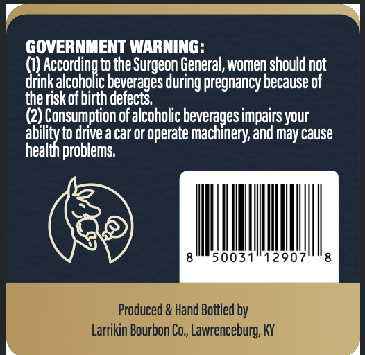
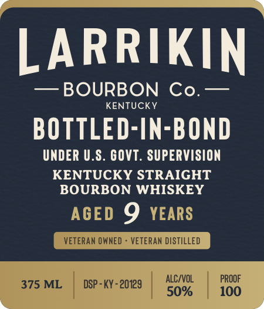

# TTB COLA Label Images - TTBID 26070001001170

**Brand Name:** LARRIKIN BOURBON CO.

**Fanciful Name:** BOTTLED IN BOND

**Issue Date:** 03/12/2026

**Origin Code:** 22

**Product Class/Type:** 111

**Source:** [TTB Public COLA Registry](https://ttbonline.gov/colasonline/viewColaDetails.do?action=publicFormDisplay&ttbid=26070001001170)

## Label Images

### Back Label

### Front Label

## Extracted Label Text

*Text extracted via OCR - may contain errors*

**Detected Proof:** 100
**Detected Age:** 9 Years

### Back Label

GOVERNMENT WARNING:

(1) retail the Surgeon General, women should not
drink alcoholic beverages during pregnancy because of
the risk of birth defects,

(2) Consumption of alcoholic beverages impairs your
aie drive a car or operate machinery, and may cause

health problems.

50031°12907'°8

### Front Label

LARRIKIN
BOURBON
Co.
KENTUCKV
BOTTLED-IN-BOND
UNDER U.S. GOVT . SUPERVISION
KENTUCKY STRAIGHT
BOURBON WHISKEY
AGED 9
YEARS
VETERAN OWNED
VETERAN DISTILLED
AlC/VOL
PROOF
375 ML
DSP - KY - 20129
50%
100
