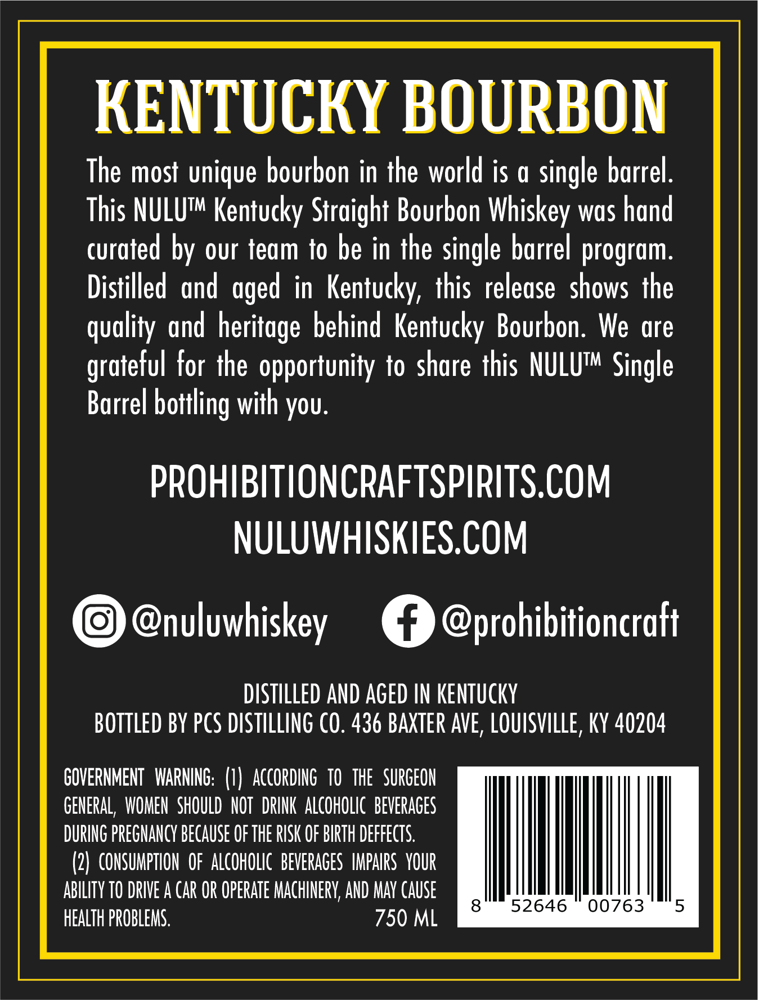
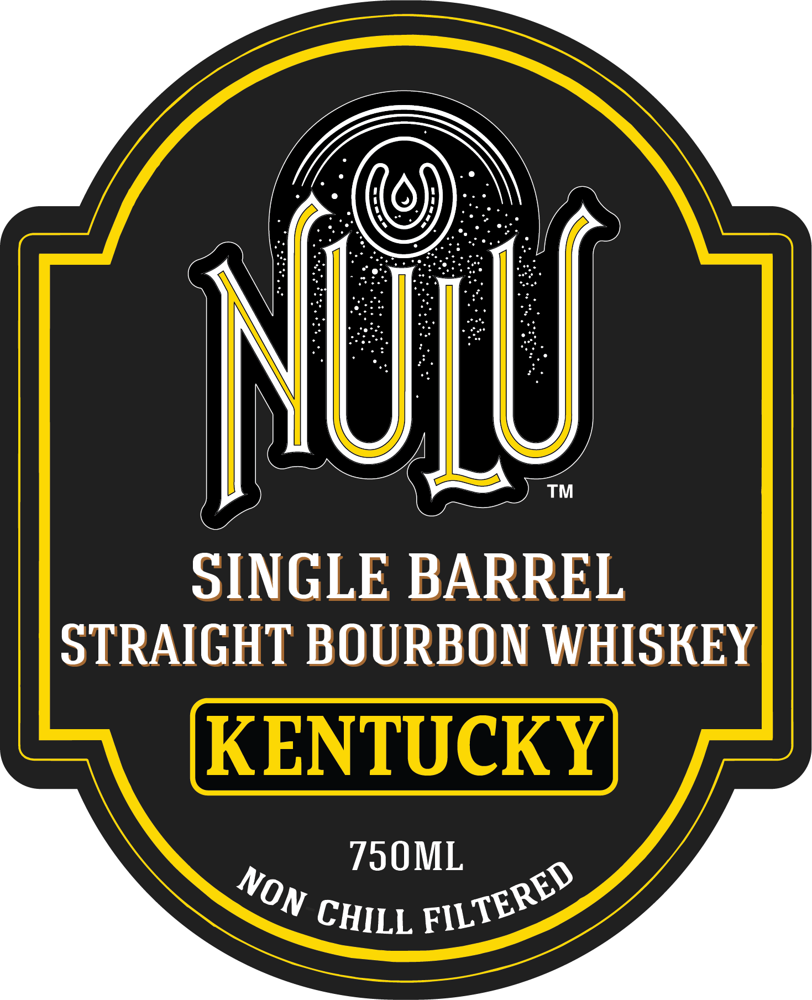
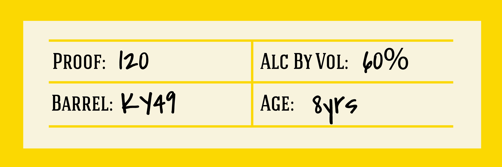

# TTB COLA Label Images - TTBID 26070001001232

**Brand Name:** NULU

**Issue Date:** 03/12/2026

**Origin Code:** 22

**Product Class/Type:** 101

**Source:** [TTB Public COLA Registry](https://ttbonline.gov/colasonline/viewColaDetails.do?action=publicFormDisplay&ttbid=26070001001232)

## Label Images

### Back Label

### Front Label

### Label 3

## Extracted Label Text

*Text extracted via OCR - may contain errors*

*1 image(s) excluded: text did not meet readability threshold*

### Back Label

KENTUCKY BOURBON
The most unique bourbon in the world is a single barrel:
This NULUt Kentucky Straight Bourbon Whiskey was hand
curated by our team to be in the single barrel program:
Distilled and
in Kentucky;  this release   shows the
quality and heritage behind Kentucky Bourbon: We are
grateful for the opportunity to share this NULUTM Single
Barrel bottling with you:
PROHIBITIONCRAFTSPIRITS.COM
NULUWHISKIES.COM
@nuluwhiskey
@prohibitioncraft
DISTILLED AND AGED IN kENTucky
BOTTLEd By PcS DISTILLING (O. 436 BAXTER AVE, LOUISVILLE, KY 40204
GOVERNMENT  WARNING: (1)  accOrding  tO   The  SURGEON
GENERAL ,  WOMEN   ShOULD  NOT  DRINK ALcohOLIC  bEVERAGES
DURING PREGNANcY BEcause OF ThE RISK OF BIRTH DEFFEcTs.
(2)  CONSUMPTION  OF ALcohoLIC   bEverAGES  IMpAIRS  YOUR
ABILITY TO DRIVE A CaR OR OPERaTe MAchINERV,AND MaY CauSe
8
52646
00763
5
HEALTh PROBLEMS.
750 ML
aged

### Front Label

TM
SINGLE BARREL
STRAIGHT BOURBON WHISKEY
KENTUCKY
750ML
NUly
FILTERED
NON
CHILL
