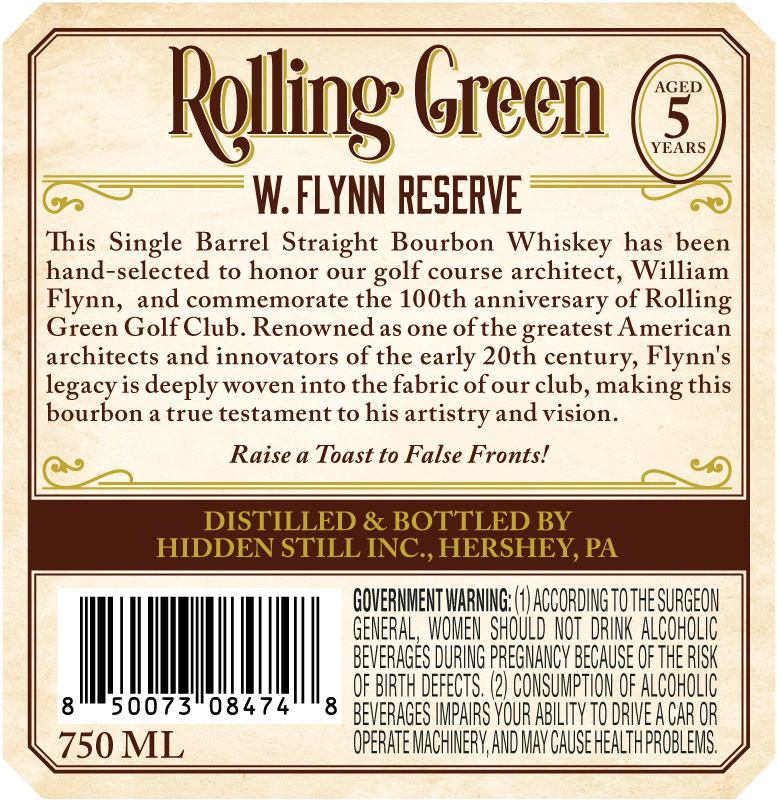
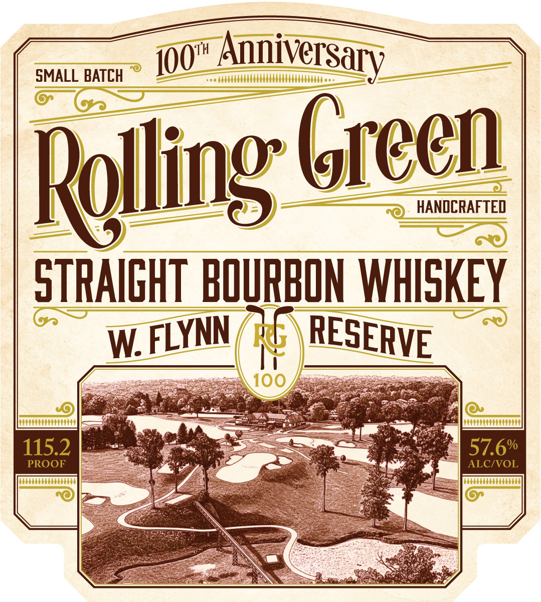

# TTB COLA Label Images - TTBID 26071001000044

**Brand Name:** ROLLING GREEN

**Issue Date:** 03/12/2026

**Origin Code:** 39

**Product Class/Type:** 101

**Source:** [TTB Public COLA Registry](https://ttbonline.gov/colasonline/viewColaDetails.do?action=publicFormDisplay&ttbid=26071001000044)

## Label Images

### Back Label

### Front Label

## Extracted Label Text

*Text extracted via OCR - may contain errors*

**Detected Proof:** 115.2
**Detected Age:** 5 Years

### Back Label

Relling Green
AGED
5
YEARS
W.FLYNN PESERVE
This Single Barrel Straight Bourbon Whiskey has been
hand-selected to honor our
course architect; William
and commemorate the 10Oth anniversary of
Rolling
Green Golf Club. Renownedas one ofthe greatest American
architects and innovators of the early 20th century, Flynn's
legacy is deeply woven into the fabric ofour club, making this
bourbon a true testament to his artistry and vision _
Raise a Toast to False Fronts!
DISTILLED & BOTTLED BY
HIDDEN STILL INC , HERSHEY, PA
GOVERMMENT WARNIG: (
ACCORDINGTOTHESURGEON
GENERAL, WOMEN SHOULD NOT  DRINK ALCOHOLIC
BEVERAGES DURING PREGMANCV BECAuSE Of thE RISK
OF BIRTH DEFECTS. (2} CONSUMPTHON OF ALCOHOLIC
8
50073"08474
8
BEVERAGES IMPARS VOUR AbiLITV TO DRWVEACaR OR
750 ML
OPERATE MACHIERV,AND MAV CAUSEHEALTHPROBLEMS.
golf
Flynn,

### Front Label

SMALL BATCH
Anniversary
Rolling Green
HANDCRAFTED
STRAIGHT  BOURBON WHISKEY
W
H
I00
115.2
57.6%
PROOF
ALCIVOL
IOOt
RESERVE
FLYNN
