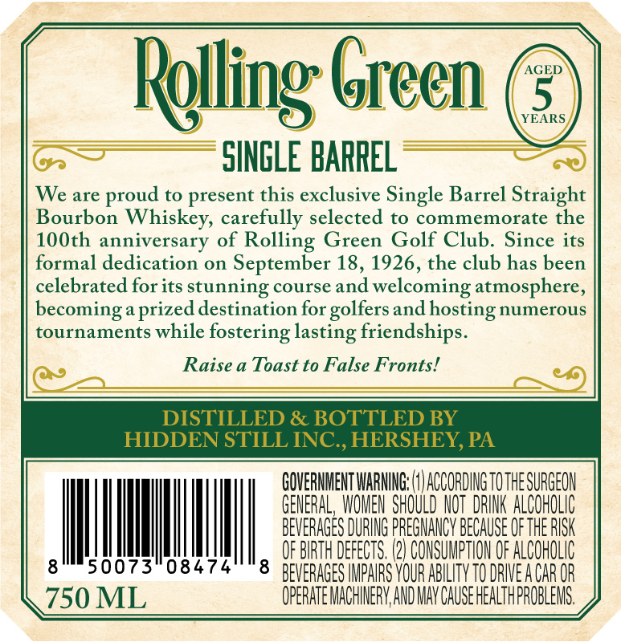
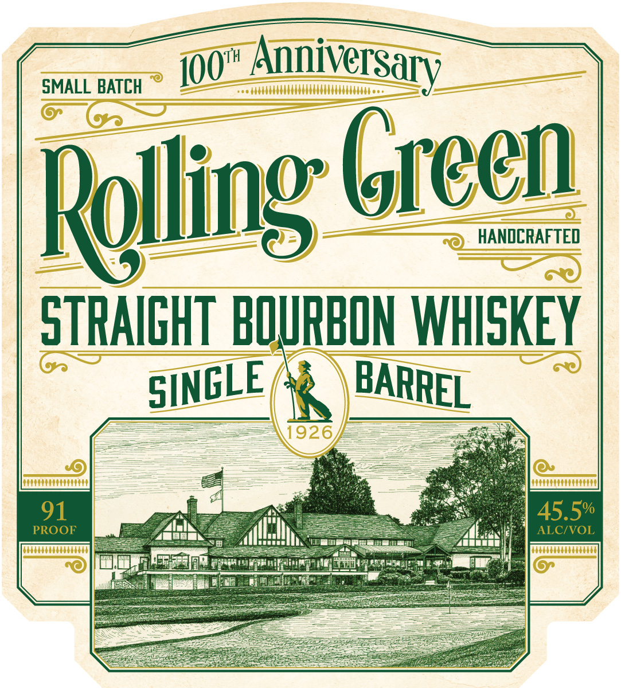

# TTB COLA Label Images - TTBID 26071001000045

**Brand Name:** ROLLING GREEN

**Issue Date:** 03/12/2026

**Origin Code:** 39

**Product Class/Type:** 101

**Source:** [TTB Public COLA Registry](https://ttbonline.gov/colasonline/viewColaDetails.do?action=publicFormDisplay&ttbid=26071001000045)

## Label Images

### Back Label

### Front Label

## Extracted Label Text

*Text extracted via OCR - may contain errors*

**Detected Proof:** 91
**Detected Age:** 5 Years

### Back Label

Relling Green
AGED
5
YEARS
SINGLE BARREL
We are
to present this exclusive Single Barrel Straight
Bourbon
Whiskey, carefully selected to commemorate the
10Oth anniversary of Rolling Green Golf Club: Since its
formal dedication on
September 18,1926, the club has been
celebrated for its
stunning course and welcoming atmosphere,
becominga prized destination for
and
hosting numerous
tournaments while
fostering lasting friendships
Raise
Toast to False Fronts!
DISTILLED & BOTTLED BY
HIDDEN STILL INC , HERSHEY, PA
GOVERNMENT WARNING;
ACCORDING TOTHE SURGEON
GENERAL, WOWEN SHOULD NOT  DRINK ALCOHOLIC
BEVERAGES DURING PREGMANCV BECAuSE Of thE RISK
OF BIRTH DEFECTS. (2} CONSUMPTHON OF ALCOHOLIC
8
50073"08474
8
BEVERAGES IMPAIRS YOUR ABILITY TO DRIEA CAR OR
750 ML
OPERATE MACHINERV,AND MAV CAUSE HEALTHPROBLEMS.
proud
golfers

### Front Label

SMALL BATCH
Anniversary
Relling Grecn
HANDCRAFTED
STRAIGHT BOURBON WHISKEY
1926
91
45.5%
PROOF
ALCIVOL
IOOt
SINGLE
BARREL
