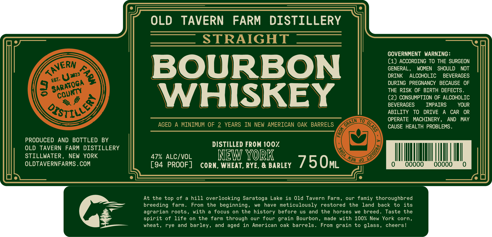

# TTB COLA Label Images - TTBID 26071001000093

**Brand Name:** OLD TAVERN FARM DISTILLERY

**Issue Date:** 03/17/2026

**Origin Code:** 02

**Product Class/Type:** 101

**Source:** [TTB Public COLA Registry](https://ttbonline.gov/colasonline/viewColaDetails.do?action=publicFormDisplay&ttbid=26071001000093)

## Label Images

### Label 1

## Extracted Label Text

*Text extracted via OCR - may contain errors*

**Detected Proof:** 94
**Detected Age:** 2 Years

### Label 1

OLD
TAVERN
FARM
DISTILLERY
STRAIGHT
GOVERNMENT WARNING:
(1) ACCORDING TO THE SURGEON
BOURBON
GENERAL ,
WOMEN
SHOULD
NOT
DRINK
ALCOHOLIC
BEVERAGES
DURING    PREGNANCY   BECAUSE  OF
THE RISK OF BIRTH DEFECTS.
WHISKEY
C2) CONSUMPTION OF ALCOHOLIC
BEVERAGES
IMPAIRS
YOUR
ABILITY
TO
DRIVE
CAR
OR
To
OPERATE
MACHINERY,
AND
MAY
AGED
A
MINIMUM OF
2
YEARS
IN NEW AMERICAN OAK BARRELS
CAUSE HEALTH PROBLEMS .
PRODUCED
AND
BOTTLED
BY
DISTILLED FROM 1007
OLD
TAVERN
FARM DISTILLERY
STILLWATER,
NEW
YORK
47% ALCIVOL
NEW YoRK
OLDTAVERNFARMS . COM
[94 PROOF]
CORN, WHEAT, RYE, & BARLEY
75OML
40 _
Ooooo
Ooooo
At the top
of
hill overlooking Saratoga Lake
is Old Tavern
Farm,
our famiy thoroughbred
breeding
farm.
From
the beginning ,
we
have meticulously
restored
the
land back
to
its
agrarian roots
with
focus
on
the history before
uS
and
the
horses
we
breed .
Taste
the
spirit of life
on the
farm through
our
four grain Bourbon ,
made
with
100% New
York
corn,
wheat ,
rye
and barley ,
and aged
in
American
oak
barrels
From grain
to glass ,
cheers!
KAVERN
3
Uz828
ESI.
SARATOGA
cqunty
8T14e)
4 $
GRAIN
GLASS
)
MAn
