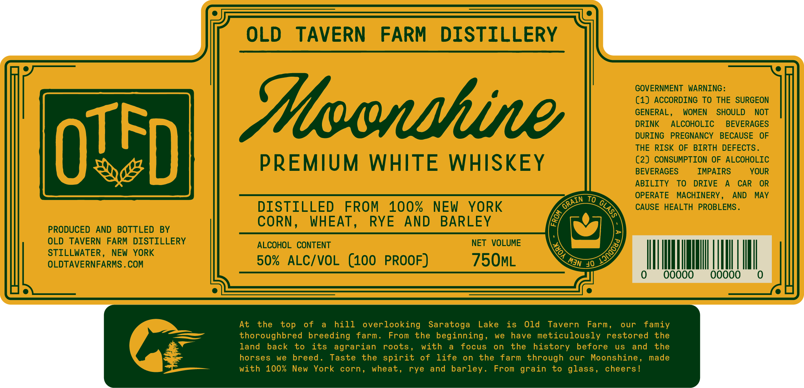

# TTB COLA Label Images - TTBID 26071001000097

**Brand Name:** OLD TAVERN FARM DISTILLERY

**Issue Date:** 03/12/2026

**Origin Code:** 02

**Product Class/Type:** 140

**Source:** [TTB Public COLA Registry](https://ttbonline.gov/colasonline/viewColaDetails.do?action=publicFormDisplay&ttbid=26071001000097)

## Label Images

### Label 1

## Extracted Label Text

*Text extracted via OCR - may contain errors*

**Detected Proof:** 100

### Label 1

OLD
TAVERN
FARM
DISTILLERY
GOVERNMENT
WARNING:
(1) ACCORDING TO THE SURGEON
Ioonhine
GENERAL =
WOMEN
SHOULD
NOT
DRINK
ALCOHOLIC
BEVERAGES
DURING
PREGNANCY
BECAUSE
OF
OTFD
THE RISK
OF
BIRTH DEFECTS .
PREMIUM
WHITE
WHISKEY
(2) CONSUMPTION OF ALCOHOLIC
BEVERAGES
IMPAIRS
YOUR
ABILITY
To
DRIVE
CAR
OR
To
OPERATE
MACHINERY ,
AND
MAY
DISTILLED
FROM
100%
NEW
YORK
CAUSE HEALTH PROBLEMS .
CORN _
WHEAT
RYE
AND
BARLEY
PRODUCED
AND
BOTTLED
BY
OLD
TAVERN
FARM DISTILLERY
ALCOHOL
CONTENT
NET VOLUME
STILLWATER,
NEW  YORK
OLDTAVERNFARMS . COM
50%
ALCIVOL
(100 PROOF)
75OML
40
Ooo
At
the
of
hill
overlooking
Saratoga
Lake
is
Old
Tavern
Farm ,
our
famiy
thoroughbred breeding
farm.
From
the beginning ,
we
have meticulously restored
the
land
back
to
its agrarian
roots
with
focus
on
the
history
before
uS
and
the
horses
we
breed _
Taste
the spirit
of
life
on
the
farm through
our
Moonshine
made
with
100%  New
York
corn,
wheat ,
rye
and barley _
From grain
to glass ,
cheers !
GRAIN
0
2
V
8
Man
top
