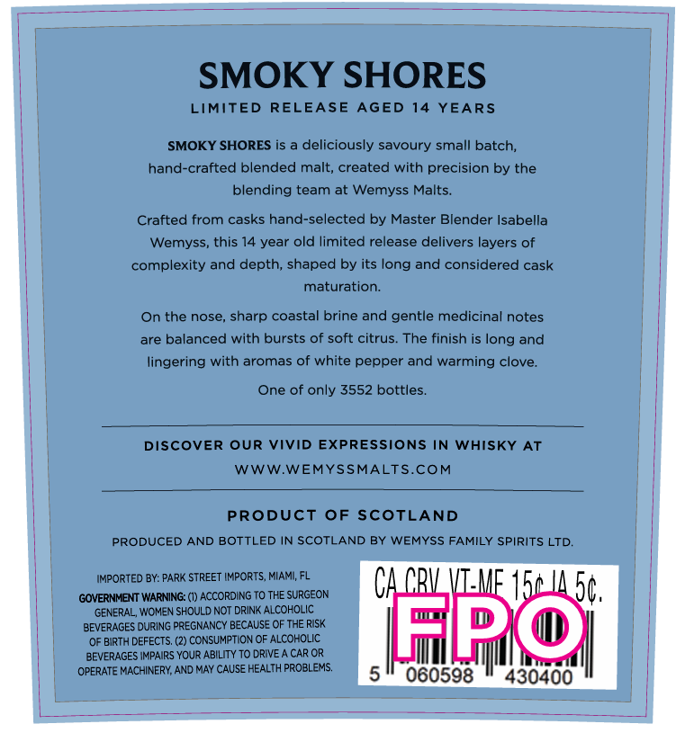
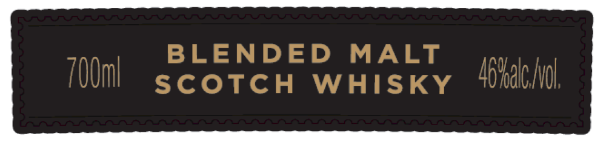
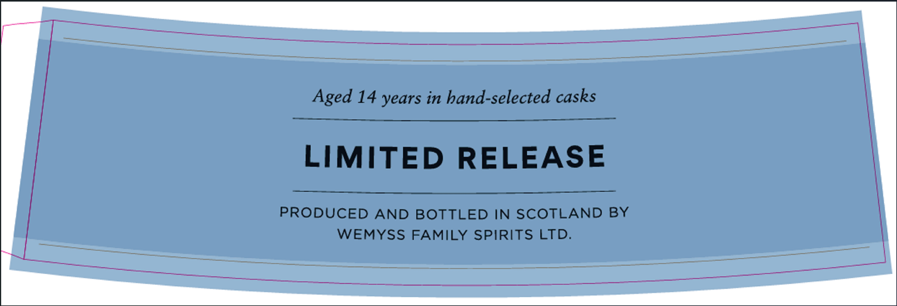

# TTB COLA Label Images - TTBID 26071001000150

**Brand Name:** WEMYSS MALTS

**Issue Date:** 03/13/2026

**Origin Code:** 5K

**Product Class/Type:** 118

**Source:** [TTB Public COLA Registry](https://ttbonline.gov/colasonline/viewColaDetails.do?action=publicFormDisplay&ttbid=26071001000150)

## Label Images

### Back Label

### Front Label

### Label 4

## Extracted Label Text

*Text extracted via OCR - may contain errors*

*1 image(s) excluded: text did not meet readability threshold*

**Detected Age:** 14 Years

### Back Label

SMOKY SHORES
LIMITED RELEASE AGED
14
YEARS
SMOKY SHORES is a deliciously savoury small batch;
hand-crafted blended malt; created with precision by the
blending team at Wemyss Malts__
Crafted from casks hand-selected by Master Blender Isabella
Wemyss
this 14 year old limited release delivers layers of
complexity and depth, shaped by its long and considered cask
maturation:
On the nose, sharp coastal brine and gentle medicinal notes
are balanced with bursts of soft citrus-
The finish is long and
lingering with aromas of white pepper and warming clove:
One of only 3552 bottles_
DISCOVER OUR
VIvId EXPRESSIONS IN WHISKY
AT
WWW.WEMYSSMALTS.COM
PRoDUCT
OF SCOTLAND
PRODUCED AND
BOTTLED IN SCOTLAND BY WEMYSS FAMILY SPIRITS LTD.
IMPORTED BY: PARK STREET IMPORTS, MIAMI FL
CA CRV VT-MF 15 I4 50
GOVERNMENT WARNING: (I) ACCORDING TO THE SURGEON
GENERAL, WOMEN SHOULD NOT DRINK ALCOHOLIC
BEVERAGES DURING PREGNANCY BECAUSE OF THE RISK
OF BIRTH DEFECTS: (2) CONSUMPTION OF ALCOHOLIC
Hmpo
BEVERAGES
YOUR ABILITY TO DRIVE
CAR OR
OPERATE MACHINERY, AND MAY CAUSE HEALTH PROBLEMS.
060598
430400
IMPAIRS -

### Label 4

Aged 14 years in hand-selected casks

LIMITED RELEASE

PRODUCED AND BOTTLED IN SCOTLAND BY
WEMYSS FAMILY SPIRITS LTD.
