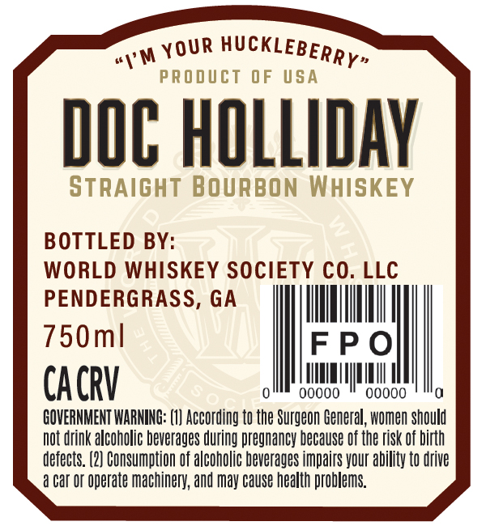
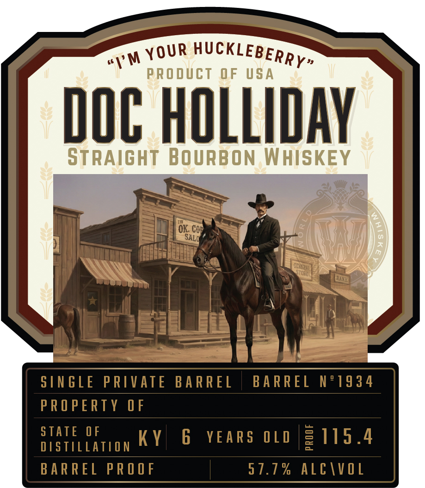

# TTB COLA Label Images - TTBID 26071001000170

**Brand Name:** DOC HOLLIDAY

**Issue Date:** 03/12/2026

**Origin Code:** 08

**Product Class/Type:** 101

**Source:** [TTB Public COLA Registry](https://ttbonline.gov/colasonline/viewColaDetails.do?action=publicFormDisplay&ttbid=26071001000170)

## Label Images

### Back Label

### Front Label

## Extracted Label Text

*Text extracted via OCR - may contain errors*

**Detected Age:** 6 Years

### Back Label

wy w YOUR HUCKLEBER py,

DOC HOLLIDAY

BOTTLED BY:
WORLD WHISKEY SOCIETY CO. LLC
PENDERGRASS, GA {iil

Oml FPO
CACRV Patera

GOVERNMENT WARNING: (1) According to the Surgeon General, women should
Not drink alcoholic beverages during pregnancy because of the risk of birth

defects. (2) Consumption of alcoholic beverages impairs your ability to drive
a Car OF operate machinery, and may cause health problems.

### Front Label

PRODUcT
0F
USA
DOC HOLLIDAY
STRAIGHT BOuRBON WHISKEY
7
OK; Coe
5 [N GLE
PRIVATE
BARREL
BA RREL
N"1934
PRO PERTY
0 F
STATE
0 F
Ky
6
YEARS 0L 0
2115.4
DSTILLATION
BARREL
PR O O F
5 7.7 %
ALc |vOL
HUcKLEBERRY"
YOUR
1'M
SALO
GEKDZIL
STONE (
