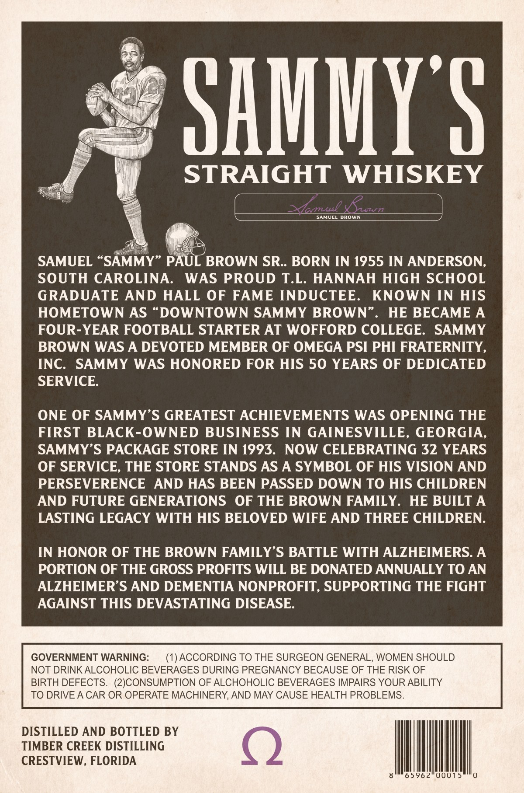
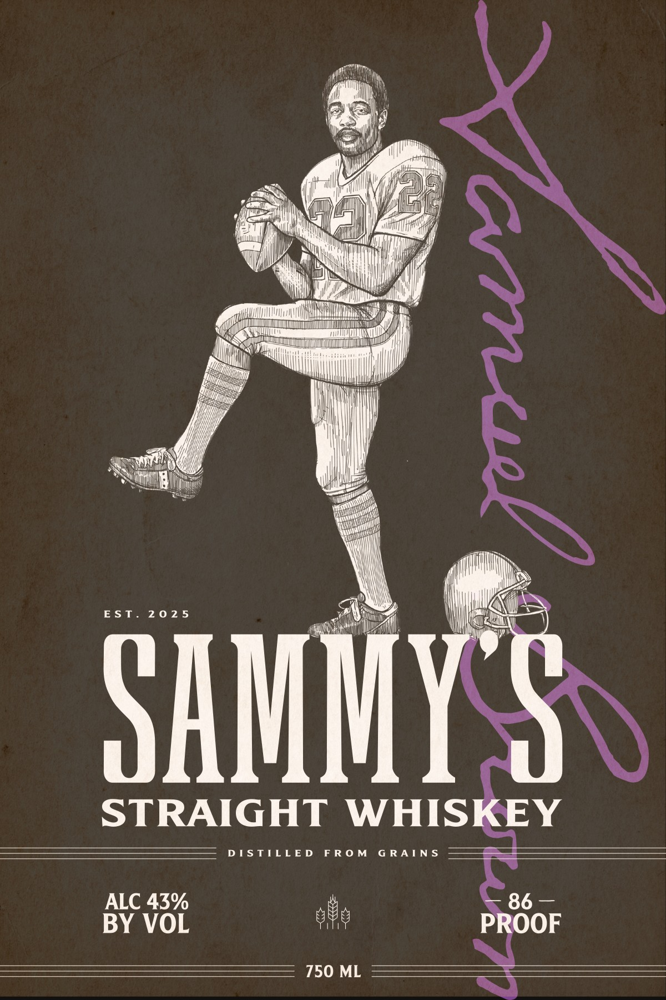

# TTB COLA Label Images - TTBID 26071001000257

**Brand Name:** SAMMY'S

**Issue Date:** 03/12/2026

**Origin Code:** 16

**Product Class/Type:** 109

**Source:** [TTB Public COLA Registry](https://ttbonline.gov/colasonline/viewColaDetails.do?action=publicFormDisplay&ttbid=26071001000257)

## Label Images

### Back Label

### Front Label

## Extracted Label Text

*Text extracted via OCR - may contain errors*

**Detected Age:** 50 Years

### Back Label

SHMMYS
STRAIGHT
WHISKEY
Tae
Lun
SAMUEL
BROWN
SAMUEL
SAMMY
PAUL BROWN SR . BORN IN 1955 IN ANDERSON,
SOUTH CAROLINA:
WAS PROUD T.L. HANNAH HIGH SCHOOL
GRADUATE
AND
HALL
OF
FAME INDUCTEE.
KNOWN
IN
HIS
HOMETOWN AS
DOWNTOWN SAMMY BROWN
HE BECAME A
FOUR-YEAR FOOTBALL STARTER AT WOFFORD COLLEGE:
SAMMY
BROWN WAS A DEVOTED MEMBER OF OMEGA PSI PHI FRATERNITY ,
INC:
SAMMY
WAS HONORED FOR HIS 50 YEARS OF DEDICATED
SERVICE.
ONE OF SAMMY'S GREATEST ACHIEVEMENTS WAS OPENING THE
FIRST BLACK-OWNED BUSINESS IN GAINESVILLE,
GEORGIA,
SAMMY'S PACKAGE STORE IN 1993.
NOW CELEBRATING 32 YEARS
OF SERVICE, THE STORE STANDS AS A SYMBOL OF HIS VISION AND
PERSEVERENCE
AND HAS BEEN PASSED DOWN TO HIS CHILDREN
AND FUTURE GENERATIONS
OF THE BROWN FAMILY.
HE BUILT A
LASTING LEGACY WITH HIS BELOVED WIFE AND THREE CHILDREN.
IN HONOR OF THE BROWN FAMILY'S BATTLE WITH ALZHEIMERS. A
PORTION OF THE GROSS PROFITS WILL BE DONATED ANNUALLY TO AN
ALZHEIMER'S AND DEMENTIA NONPROFIT, SUPPORTING THE FIGHT
AGAINST THIS DEVASTATING DISEASE:
GOVERNMENT WARNING:
ACCORDING TO THE SURGEON GENERAL, WOMEN SHOULD
NOT DRINK ALCOHOLIC BEVERAGES DURING PREGNANCY BECAUSE OF THE RISK OF
BIRTH DEFECTS.   (2JCONSUMPTION OF ALCHOHOLIC BEVERAGES IMPAIRS YOUR ABILITY
TO DRIVE A CAR OR OPERATE MACHINERY, AND MAY CAUSE HEALTH PROBLEMS.
DISTILLED AND BOTTLED BY
TIMBER CREEK DISTILLING
CRESTVIEW, FLORIDA
65962"00015

### Front Label

ly

MY

Hp.

al

i)

jal

)

ll

en

Air

WHT

|

Mh

bal

a

EST. 2025

DAM

STRAIGHT WHISKEY

DISTILLED FROM GRAINS

ALC 43%

86 —

BY VOL

ae

DOF

750 ML
