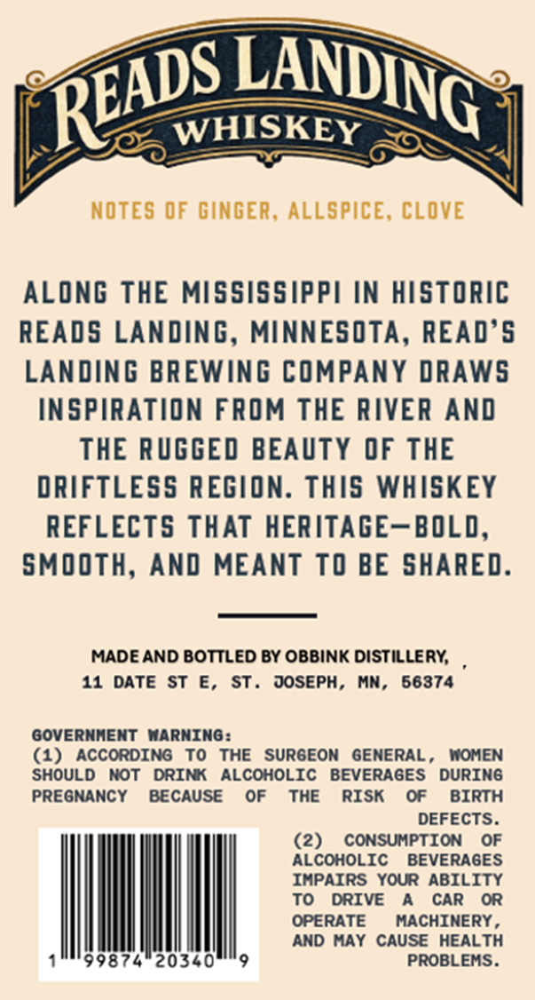
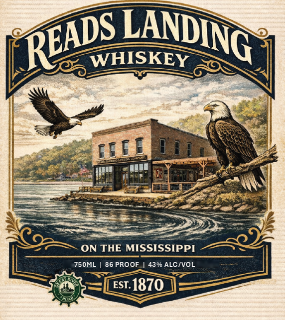

# TTB COLA Label Images - TTBID 26071001000321

**Brand Name:** READS LANDING

**Issue Date:** 03/23/2026

**Origin Code:** 27

**Product Class/Type:** 140

**Source:** [TTB Public COLA Registry](https://ttbonline.gov/colasonline/viewColaDetails.do?action=publicFormDisplay&ttbid=26071001000321)

## Label Images

### Back Label

### Front Label

## Extracted Label Text

*Text extracted via OCR - may contain errors*

**Detected Proof:** 86

### Back Label

WHISKEY
NOTES 0F GINGER, ALLSPICE, CLOVE
ALONG THE MISSISSIPPI IN HISTORIC
READS LANDING, MINNESOTA, READ'5
LANDING BREWING COMPANY DRAWS
INSPIRATION FROM THE RIVER AND
THE RUGGED BEAUTY OF THE
DRIFTLESS REGION. THIS WHISKEY
REFLECTS THAT HERITAGE-BOLD,
SMOOTH, AND MEANT TO BE SHARED.
MADE AND BOTTLED BY OBBINK DISTILLERY;
11
DATESt
E,
ST .
JOSEPH ,
MN,
56374
GOVERNHENT NARNING:
(1)
ACCORDING
To
THE
SURGEON  GENERAL ,
MOMEN
SHOULD
NoT
DRINK
ALCOHOLIC
BEVERAGES
DURING
PREGNANCY
BECAUSE
OF
ThE
RISK
OF
BIRTH
DEFECTS.
(2)
CONSUMPTION
OF
ALCOHOLIC
BEVERAGES
IHPAIRS Your ABILITY
To
DRIVE
CAR
OR
OPERATE
MACHINERY
AND HAY CAUSE
HEALTH
99874
20340
PROBLEMS.
LANDING
READS

### Front Label

WHISKEY
ON THE MISSISSIPPI
750ML
86 PROOF
439 ALCIVOL
EST
1870
LANDING
READS
