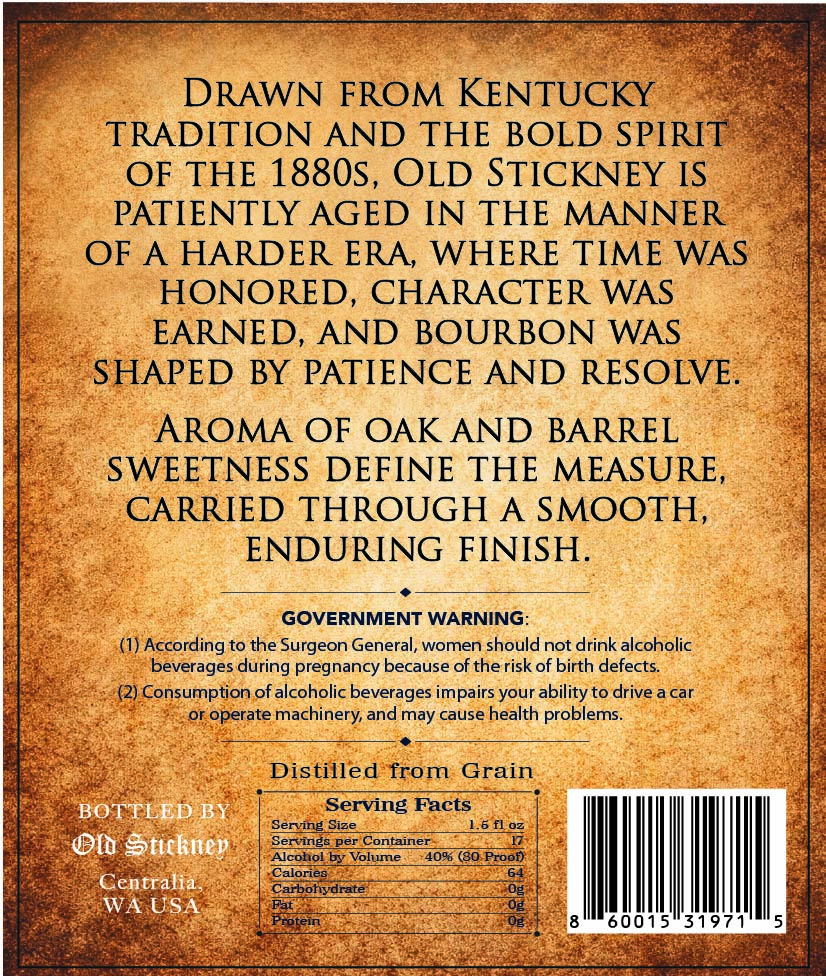
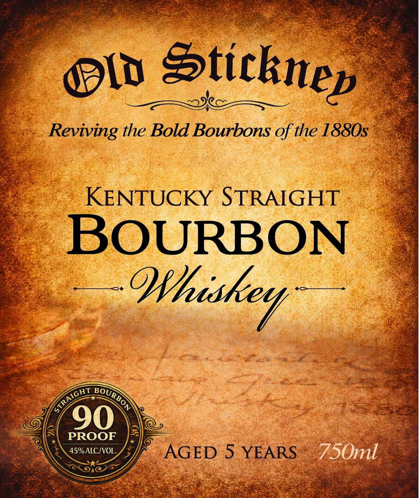

# TTB COLA Label Images - TTBID 26071001000608

**Brand Name:** OLD STICKNEY

**Fanciful Name:** KENTUCKY STRAIGHT BOURBON

**Issue Date:** 03/17/2026

**Origin Code:** 07

**Product Class/Type:** 101

**Source:** [TTB Public COLA Registry](https://ttbonline.gov/colasonline/viewColaDetails.do?action=publicFormDisplay&ttbid=26071001000608)

## Label Images

### Back Label

### Front Label

## Extracted Label Text

*Text extracted via OCR - may contain errors*

*1 image(s) excluded: text did not meet readability threshold*

**Detected Proof:** 80

### Back Label

DRAWN FROM KENTUCKY
TRADITION AND THE BOLD SPIRIT
OF
THE 1880S,
OLD STICKNEY IS
PATIENTLY AGED
IN THE MANNER
OF A
HARDER ERA_
WHERE TIME
WAS
HONORED_
CHARACTER WAS
EARNED; AND BOURBON
WAS
SHAPED
BY PATIENCE AND RESOLVE.
AROMA
OF OAK AND BARREL
SWEETNESS
DEFINE THE MEASURE,
CARRIED THROUGH
A SMOOTH
ENDURING FINISH
GOVERNMENT WARNING
(1) According to the Surgeon General, women should not drink alcoholic
beverages during pregnancy because of the risk of birth defects
(2) Consumption of alcoholic beverages impairs your ability to drive a car
or operate
machinery, and may cause health problems_
Distilled
from
Grain
BOTTLED BY
Serving Facts
Serving Size
L6 fLoz
Qlb Stickuep
Servinge per Container
Alcohol by Volume
40% (80 Proof)
Calories
Centralia
Carbohydrate
WA USA
Fat
Protein
