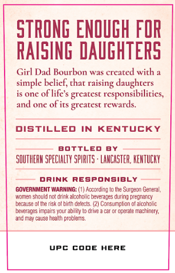
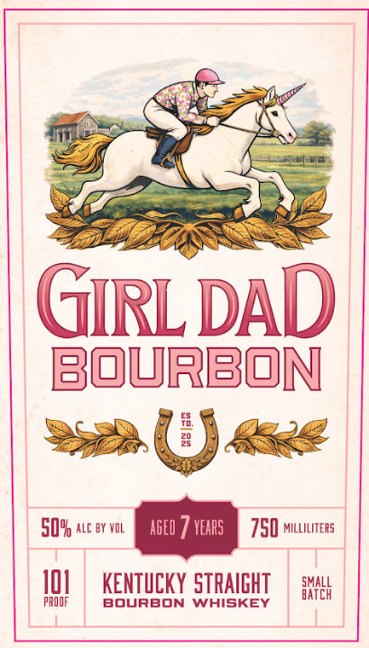

# TTB COLA Label Images - TTBID 26071001000613

**Brand Name:** GIRL DAD

**Issue Date:** 03/12/2026

**Origin Code:** 22

**Product Class/Type:** 101

**Source:** [TTB Public COLA Registry](https://ttbonline.gov/colasonline/viewColaDetails.do?action=publicFormDisplay&ttbid=26071001000613)

## Label Images

### Back Label

### Front Label

## Extracted Label Text

*Text extracted via OCR - may contain errors*

### Back Label

STRONG ENOUGH FOR
RAISING DAUGHTERS
Girl Dad Bourbon was created with
simple belief; chat
daughters
is onc
oflife $ greatest responsibilitics,
and one of its greatest rewards.
DISTILLED
IN
KENTUCKY
BOtTLED
BY
SOUTHERH SPECHALTY SpHRITS : LANCASTER, KENTUCKY
DRINK
RESPONSIBLY
GOVERNMENT WARNING:
According lo Ihe Surgeon General,
Wcmen should not drink alcaholic
beverages during pregnancy
because 0l Ine risk 0f blnn defects: (2) Consumplion of alconolic
beverageS Impairs your abillty
drive
operato
machinery,
and Ma cauSO healih problets
UPC CODE
HERE
raising

### Front Label

GIRLDAD
bourbon
E
29
50YU ale by VOL
AgEl
veaRS
750 milliliters
I0
KENTUCKY STRAIGHT
HXHH
PRQOF
BourBOn
WHISKEY
